# Technical Specifications

## 1. INTRODUCTION

### EXECUTIVE SUMMARY

| Aspect | Description |
|--------|-------------|
| Project Overview | A simple Node.js HTTP server application that exposes a single REST endpoint `/hello` which returns "Hello world" to clients |
| Business Problem | Provides a minimal, functional example of a Node.js web service that can serve as a learning tool or starter template |
| Key Stakeholders | Developers learning Node.js, technical trainers, software engineers requiring a baseline implementation |
| Value Proposition | Demonstrates fundamental Node.js web service concepts with minimal complexity, enabling rapid learning and prototyping |

### SYSTEM OVERVIEW

#### Project Context

The Node.js Hello World service operates as a standalone educational tool that demonstrates:
- Basic HTTP server implementation in Node.js
- RESTful endpoint design and implementation
- Modern JavaScript server-side development practices
- Foundational web service architecture

This project does not replace any existing system but serves as an entry point for Node.js development education.

#### High-Level Description

| Component | Description |
|-----------|-------------|
| Primary Capabilities | HTTP request handling, response generation, and server lifecycle management |
| Major Components | Node.js runtime, HTTP server module, route handler for `/hello` endpoint |
| Technical Approach | Lightweight, dependency-minimal implementation focusing on Node.js core modules |

#### Success Criteria

| Criteria Type | Description |
|---------------|-------------|
| Measurable Objectives | - Server successfully starts and listens on configured port<br>- `/hello` endpoint returns "Hello world" with 200 status code<br>- Documentation enables new developers to understand and run the service |
| Critical Success Factors | - Code simplicity and readability<br>- Proper error handling<br>- Clear documentation |
| Key Performance Indicators | - Time to understand (for new developers)<br>- Time to deploy<br>- Response time under load |

### SCOPE

#### In-Scope

**Core Features and Functionalities:**
- HTTP server implementation using Node.js
- Single `/hello` endpoint returning "Hello world" text response
- Basic error handling for server startup
- Proper HTTP status codes and headers

**Implementation Boundaries:**
- Single-server architecture
- Local development environment support
- Command-line interface for server management
- Standard HTTP protocol support

#### Out-of-Scope

- Authentication and authorization mechanisms
- Database integration or persistent storage
- Multiple endpoints beyond `/hello`
- Production deployment configurations
- Containerization or orchestration
- Logging infrastructure beyond console output
- Performance optimization beyond basic practices
- Client-side application or frontend components
- API versioning
- Rate limiting or throttling mechanisms

## 2. PRODUCT REQUIREMENTS

### FEATURE CATALOG

#### Feature Metadata

| ID | Feature Name | Feature Category | Priority Level | Status |
|----|--------------|------------------|----------------|--------|
| F-001 | HTTP Server | Core Infrastructure | Critical | Proposed |
| F-002 | Hello Endpoint | API | Critical | Proposed |
| F-003 | Server Configuration | Configuration | High | Proposed |
| F-004 | Error Handling | Reliability | High | Proposed |

#### Feature Descriptions

**F-001: HTTP Server**

| Aspect | Description |
|--------|-------------|
| Overview | A Node.js HTTP server that listens for incoming requests on a configurable port |
| Business Value | Provides the foundation for serving HTTP requests in a lightweight, efficient manner |
| User Benefits | Enables developers to understand basic Node.js server implementation patterns |
| Technical Context | Utilizes Node.js core HTTP module to create and manage server lifecycle |

**Dependencies:**
- System Dependencies: Node.js runtime environment
- External Dependencies: None
- Integration Requirements: None

**F-002: Hello Endpoint**

| Aspect | Description |
|--------|-------------|
| Overview | REST endpoint at path `/hello` that returns "Hello world" text response |
| Business Value | Demonstrates basic request handling and response generation |
| User Benefits | Provides a simple, working example of REST API implementation |
| Technical Context | Implements route handling logic to process HTTP GET requests to the `/hello` path |

**Dependencies:**
- Prerequisite Features: F-001 (HTTP Server)
- System Dependencies: None
- External Dependencies: None
- Integration Requirements: None

**F-003: Server Configuration**

| Aspect | Description |
|--------|-------------|
| Overview | Configuration mechanism for server port and basic settings |
| Business Value | Enables flexibility in deployment and runtime configuration |
| User Benefits | Allows developers to customize server behavior without code changes |
| Technical Context | Implements environment variable support for configuration parameters |

**Dependencies:**
- Prerequisite Features: F-001 (HTTP Server)
- System Dependencies: None
- External Dependencies: None
- Integration Requirements: None

**F-004: Error Handling**

| Aspect | Description |
|--------|-------------|
| Overview | Basic error handling for server startup and request processing |
| Business Value | Improves reliability and debuggability of the application |
| User Benefits | Provides clear feedback when errors occur |
| Technical Context | Implements try/catch blocks and error event listeners |

**Dependencies:**
- Prerequisite Features: F-001 (HTTP Server)
- System Dependencies: None
- External Dependencies: None
- Integration Requirements: None

### FUNCTIONAL REQUIREMENTS TABLE

**F-001: HTTP Server**

| Requirement ID | Description | Acceptance Criteria | Priority | Complexity |
|----------------|-------------|---------------------|----------|------------|
| F-001-RQ-001 | The system shall create an HTTP server using Node.js | Server initializes without errors | Must-Have | Low |
| F-001-RQ-002 | The server shall listen on a configurable port | Server binds to specified port | Must-Have | Low |
| F-001-RQ-003 | The server shall handle incoming HTTP requests | Server receives and processes HTTP requests | Must-Have | Low |

**Technical Specifications:**
- Input Parameters: Port number (default: 3000)
- Output/Response: Running HTTP server instance
- Performance Criteria: Server startup time < 1 second
- Data Requirements: None

**Validation Rules:**
- Business Rules: None
- Data Validation: Port number must be a valid integer between 1024-65535
- Security Requirements: None
- Compliance Requirements: None

**F-002: Hello Endpoint**

| Requirement ID | Description | Acceptance Criteria | Priority | Complexity |
|----------------|-------------|---------------------|----------|------------|
| F-002-RQ-001 | The system shall implement a GET endpoint at path `/hello` | Endpoint responds to GET requests at `/hello` | Must-Have | Low |
| F-002-RQ-002 | The endpoint shall return "Hello world" as plain text | Response body contains exactly "Hello world" | Must-Have | Low |
| F-002-RQ-003 | The endpoint shall return HTTP status code 200 | Response status code is 200 | Must-Have | Low |
| F-002-RQ-004 | The endpoint shall set appropriate content type header | Content-Type header is "text/plain" | Should-Have | Low |

**Technical Specifications:**
- Input Parameters: None
- Output/Response: Text string "Hello world"
- Performance Criteria: Response time < 50ms
- Data Requirements: None

**Validation Rules:**
- Business Rules: None
- Data Validation: None
- Security Requirements: None
- Compliance Requirements: None

**F-003: Server Configuration**

| Requirement ID | Description | Acceptance Criteria | Priority | Complexity |
|----------------|-------------|---------------------|----------|------------|
| F-003-RQ-001 | The system shall support configuration of server port | Server uses port from environment variable if available | Should-Have | Low |
| F-003-RQ-002 | The system shall provide a default port when not configured | Server uses default port 3000 when no port is specified | Must-Have | Low |

**Technical Specifications:**
- Input Parameters: PORT environment variable
- Output/Response: None
- Performance Criteria: None
- Data Requirements: None

**Validation Rules:**
- Business Rules: None
- Data Validation: Port must be a valid number
- Security Requirements: None
- Compliance Requirements: None

**F-004: Error Handling**

| Requirement ID | Description | Acceptance Criteria | Priority | Complexity |
|----------------|-------------|---------------------|----------|------------|
| F-004-RQ-001 | The system shall handle server startup errors | Error messages are logged to console | Must-Have | Low |
| F-004-RQ-002 | The system shall handle request processing errors | Server remains operational after request errors | Should-Have | Medium |

**Technical Specifications:**
- Input Parameters: None
- Output/Response: Error messages to console
- Performance Criteria: None
- Data Requirements: None

**Validation Rules:**
- Business Rules: None
- Data Validation: None
- Security Requirements: None
- Compliance Requirements: None

### FEATURE RELATIONSHIPS

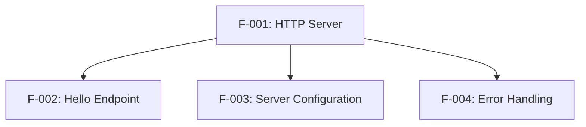
```mermaid
graph TD
    F001[F-001: HTTP Server]
    F002[F-002: Hello Endpoint]
    F003[F-003: Server Configuration]
    F004[F-004: Error Handling]
    
    F001 --> F002
    F001 --> F003
    F001 --> F004
```

**Integration Points:**
- The HTTP Server (F-001) provides the foundation for the Hello Endpoint (F-002)
- Server Configuration (F-003) directly affects HTTP Server (F-001) initialization
- Error Handling (F-004) is integrated with both server startup and request processing

### IMPLEMENTATION CONSIDERATIONS

**F-001: HTTP Server**

| Consideration | Description |
|---------------|-------------|
| Technical Constraints | Use Node.js core modules only |
| Performance Requirements | Minimal memory footprint |
| Scalability Considerations | None for tutorial purposes |
| Security Implications | None for tutorial purposes |
| Maintenance Requirements | Keep compatible with current Node.js LTS versions |

**F-002: Hello Endpoint**

| Consideration | Description |
|---------------|-------------|
| Technical Constraints | Implement using standard request/response pattern |
| Performance Requirements | Response time < 50ms |
| Scalability Considerations | None for tutorial purposes |
| Security Implications | None for tutorial purposes |
| Maintenance Requirements | None |

**F-003: Server Configuration**

| Consideration | Description |
|---------------|-------------|
| Technical Constraints | Use environment variables for configuration |
| Performance Requirements | None |
| Scalability Considerations | None for tutorial purposes |
| Security Implications | None for tutorial purposes |
| Maintenance Requirements | None |

**F-004: Error Handling**

| Consideration | Description |
|---------------|-------------|
| Technical Constraints | Use standard Node.js error handling patterns |
| Performance Requirements | None |
| Scalability Considerations | None for tutorial purposes |
| Security Implications | Ensure errors don't expose sensitive information |
| Maintenance Requirements | None |

### TRACEABILITY MATRIX

| Requirement ID | Feature ID | Feature Name | Priority | Status |
|----------------|------------|--------------|----------|--------|
| F-001-RQ-001 | F-001 | HTTP Server | Must-Have | Proposed |
| F-001-RQ-002 | F-001 | HTTP Server | Must-Have | Proposed |
| F-001-RQ-003 | F-001 | HTTP Server | Must-Have | Proposed |
| F-002-RQ-001 | F-002 | Hello Endpoint | Must-Have | Proposed |
| F-002-RQ-002 | F-002 | Hello Endpoint | Must-Have | Proposed |
| F-002-RQ-003 | F-002 | Hello Endpoint | Must-Have | Proposed |
| F-002-RQ-004 | F-002 | Hello Endpoint | Should-Have | Proposed |
| F-003-RQ-001 | F-003 | Server Configuration | Should-Have | Proposed |
| F-003-RQ-002 | F-003 | Server Configuration | Must-Have | Proposed |
| F-004-RQ-001 | F-004 | Error Handling | Must-Have | Proposed |
| F-004-RQ-002 | F-004 | Error Handling | Should-Have | Proposed |

## 3. TECHNOLOGY STACK

### PROGRAMMING LANGUAGES

| Language | Version | Component | Justification |
|----------|---------|-----------|---------------|
| JavaScript | ES2022 | Server | Node.js natively supports modern JavaScript, providing a lightweight and efficient runtime for HTTP server implementation |
| JSON | - | Configuration | Industry standard for configuration files and package metadata |

**Selection Criteria:**
- JavaScript is the native language of Node.js, making it the optimal choice for this simple HTTP server
- Modern JavaScript features simplify error handling and asynchronous operations
- No transpilation required, reducing build complexity

### FRAMEWORKS & LIBRARIES

| Framework/Library | Version | Purpose | Justification |
|-------------------|---------|---------|---------------|
| Node.js | 18.x LTS | Runtime environment | Long-term support version provides stability and security updates |
| Node.js HTTP module | Core | HTTP server implementation | Built-in module eliminates external dependencies while providing all necessary HTTP server functionality |

**Compatibility Requirements:**
- Compatible with all major operating systems (Windows, macOS, Linux)
- No browser compatibility concerns as this is server-side only

**Justification:**
- Using Node.js core modules exclusively eliminates dependency management complexity
- The built-in HTTP module is sufficient for implementing a simple endpoint without additional frameworks
- Minimalist approach aligns with educational goals of the project

### OPEN SOURCE DEPENDENCIES

| Dependency | Version | Purpose | Source |
|------------|---------|---------|--------|
| None | - | - | - |

**Dependency Management:**
- Package.json will be used to define project metadata and scripts
- No runtime dependencies required beyond Node.js core modules
- Potential dev dependencies may be added for testing or development workflow

### THIRD-PARTY SERVICES

No third-party services are required for this simple HTTP server implementation.

### DATABASES & STORAGE

No databases or storage solutions are required as the application does not persist any data.

### DEVELOPMENT & DEPLOYMENT

| Tool/Technology | Version | Purpose | Justification |
|-----------------|---------|---------|---------------|
| npm | 9.x+ | Package management | Standard package manager for Node.js ecosystem |
| nodemon | 2.x | Development server | Optional dev dependency for automatic server restarts during development |
| Git | 2.x+ | Version control | Industry standard for source code management |

**Development Environment:**
- Any text editor or IDE with JavaScript support
- Terminal/command line for server management
- Node.js runtime installed locally

**Deployment Options:**
- Local execution for educational purposes
- Simple deployment to any Node.js-compatible hosting environment if needed

**Build Process:**
- No build process required as the application uses native Node.js features
- Direct execution of JavaScript source files

### TECHNOLOGY STACK DIAGRAM

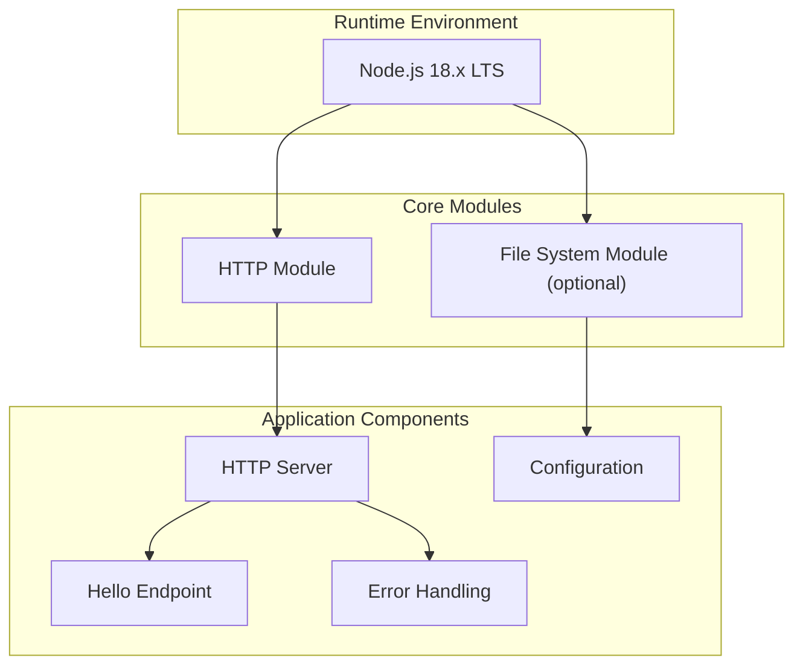
```mermaid
graph TD
    subgraph "Runtime Environment"
        Node["Node.js 18.x LTS"]
    end
    
    subgraph "Core Modules"
        HTTP["HTTP Module"]
        FS["File System Module (optional)"]
    end
    
    subgraph "Application Components"
        Server["HTTP Server"]
        HelloEndpoint["Hello Endpoint"]
        Config["Configuration"]
        ErrorHandling["Error Handling"]
    end
    
    Node --> HTTP
    Node --> FS
    HTTP --> Server
    Server --> HelloEndpoint
    Server --> ErrorHandling
    FS --> Config
```

## 4. PROCESS FLOWCHART

### SYSTEM WORKFLOWS

#### Core Business Processes

**HTTP Request Processing Workflow**

This workflow represents the end-to-end journey of an HTTP request from client to server and back.

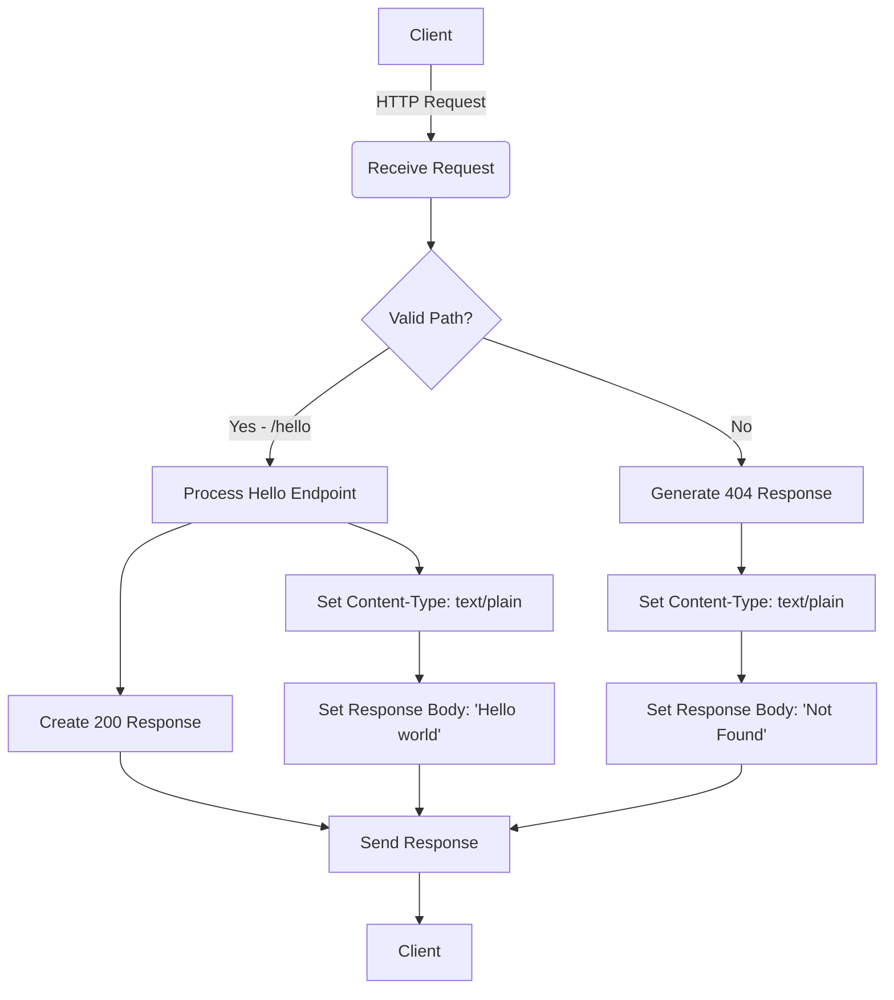
```mermaid
flowchart TD
    A[Client] -->|HTTP Request| B(Receive Request)
    B --> C{Valid Path?}
    C -->|Yes - /hello| D[Process Hello Endpoint]
    C -->|No| E[Generate 404 Response]
    D --> F[Create 200 Response]
    D --> G[Set Content-Type: text/plain]
    G --> H[Set Response Body: 'Hello world']
    E --> I[Set Content-Type: text/plain]
    I --> J[Set Response Body: 'Not Found']
    F --> K[Send Response]
    H --> K
    J --> K
    K --> L[Client]
```

**Server Startup Process**

This workflow details the server initialization and startup sequence.

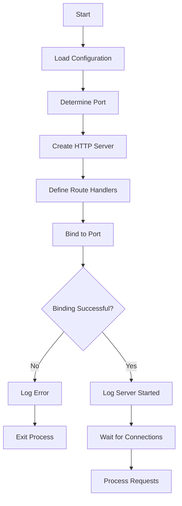
```mermaid
flowchart TD
    A[Start] --> B[Load Configuration]
    B --> C[Determine Port]
    C --> D[Create HTTP Server]
    D --> E[Define Route Handlers]
    E --> F[Bind to Port]
    F --> G{Binding Successful?}
    G -->|Yes| H[Log Server Started]
    G -->|No| I[Log Error]
    I --> J[Exit Process]
    H --> K[Wait for Connections]
    K --> L[Process Requests]
```

#### Integration Workflows

**Request-Response Data Flow**

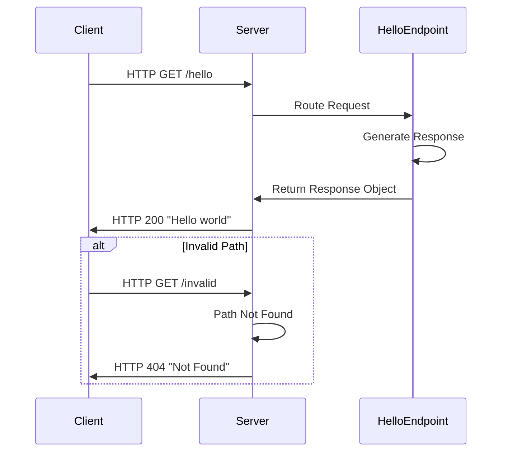
```mermaid
sequenceDiagram
    participant Client
    participant Server
    participant HelloEndpoint
    
    Client->>Server: HTTP GET /hello
    Server->>HelloEndpoint: Route Request
    HelloEndpoint->>HelloEndpoint: Generate Response
    HelloEndpoint->>Server: Return Response Object
    Server->>Client: HTTP 200 "Hello world"
    
    alt Invalid Path
        Client->>Server: HTTP GET /invalid
        Server->>Server: Path Not Found
        Server->>Client: HTTP 404 "Not Found"
    end
```

### FLOWCHART REQUIREMENTS

#### Main Application Workflow

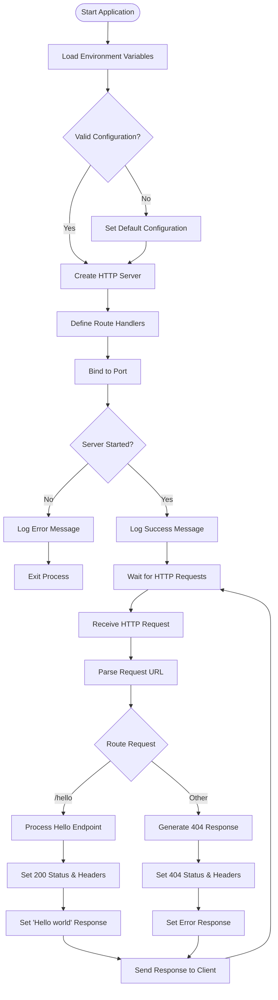
```mermaid
flowchart TD
    Start([Start Application]) --> LoadEnv[Load Environment Variables]
    LoadEnv --> ValidateConfig{Valid Configuration?}
    ValidateConfig -->|Yes| CreateServer[Create HTTP Server]
    ValidateConfig -->|No| SetDefaults[Set Default Configuration]
    SetDefaults --> CreateServer
    
    CreateServer --> DefineRoutes[Define Route Handlers]
    DefineRoutes --> BindPort[Bind to Port]
    BindPort --> ServerStarted{Server Started?}
    
    ServerStarted -->|Yes| LogSuccess[Log Success Message]
    ServerStarted -->|No| LogError[Log Error Message]
    LogError --> ExitProcess[Exit Process]
    
    LogSuccess --> WaitRequests[Wait for HTTP Requests]
    
    WaitRequests --> ReceiveRequest[Receive HTTP Request]
    ReceiveRequest --> ParseRequest[Parse Request URL]
    ParseRequest --> RouteRequest{Route Request}
    
    RouteRequest -->|/hello| HelloEndpoint[Process Hello Endpoint]
    RouteRequest -->|Other| NotFoundHandler[Generate 404 Response]
    
    HelloEndpoint --> SetSuccessHeaders[Set 200 Status & Headers]
    SetSuccessHeaders --> SetResponseBody["Set 'Hello world' Response"]
    SetResponseBody --> SendResponse[Send Response to Client]
    
    NotFoundHandler --> SetErrorHeaders[Set 404 Status & Headers]
    SetErrorHeaders --> SetErrorBody[Set Error Response]
    SetErrorBody --> SendResponse
    
    SendResponse --> WaitRequests
```

#### Hello Endpoint Processing

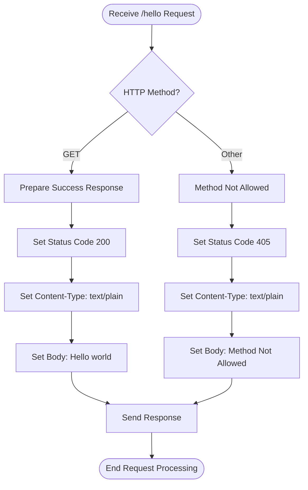
```mermaid
flowchart TD
    Start([Receive /hello Request]) --> ValidateMethod{HTTP Method?}
    ValidateMethod -->|GET| PrepareResponse[Prepare Success Response]
    ValidateMethod -->|Other| MethodNotAllowed[Method Not Allowed]
    
    PrepareResponse --> SetStatus[Set Status Code 200]
    SetStatus --> SetHeaders[Set Content-Type: text/plain]
    SetHeaders --> SetBody[Set Body: Hello world]
    SetBody --> SendResponse[Send Response]
    
    MethodNotAllowed --> SetErrorStatus[Set Status Code 405]
    SetErrorStatus --> SetErrorHeaders[Set Content-Type: text/plain]
    SetErrorHeaders --> SetErrorBody[Set Body: Method Not Allowed]
    SetErrorBody --> SendResponse
    
    SendResponse --> End([End Request Processing])
```

#### Validation Rules

| Process Step | Validation Rules | Error Handling |
|--------------|------------------|----------------|
| Server Configuration | Port must be a valid number between 1024-65535 | Use default port 3000 if invalid |
| Request Routing | URL path must be valid | Return 404 for invalid paths |
| HTTP Method Validation | Only GET method allowed for /hello endpoint | Return 405 for other methods |
| Response Generation | Response must have valid status code and headers | Set defaults if missing |

### TECHNICAL IMPLEMENTATION

#### State Management

**Server State Transitions**

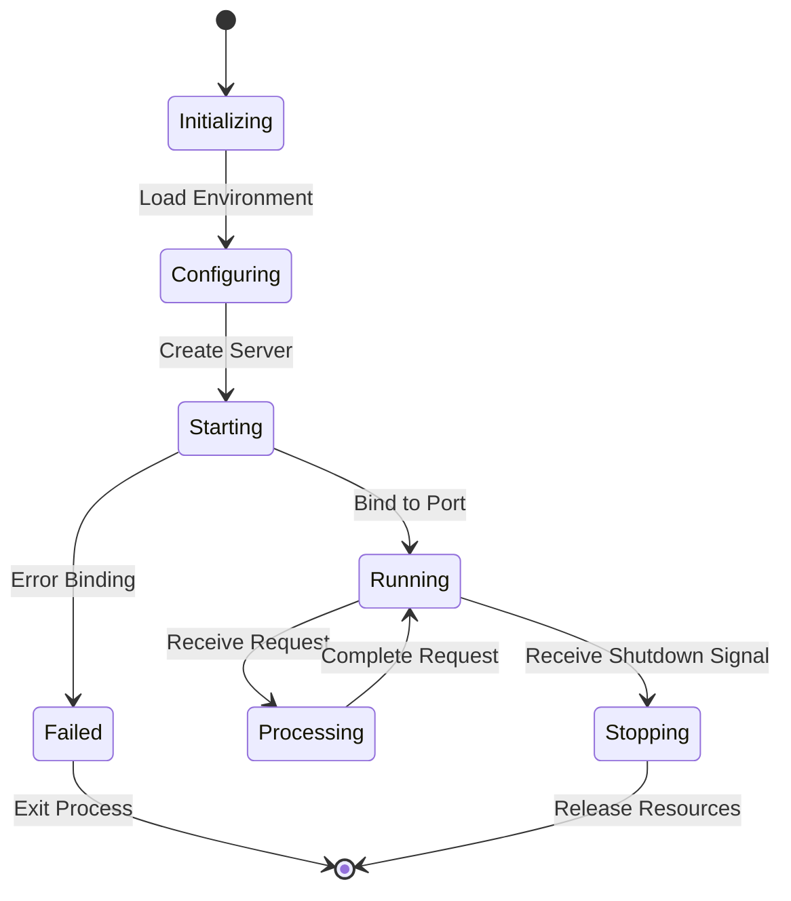
```mermaid
stateDiagram-v2
    [*] --> Initializing
    Initializing --> Configuring: Load Environment
    Configuring --> Starting: Create Server
    Starting --> Running: Bind to Port
    Starting --> Failed: Error Binding
    Failed --> [*]: Exit Process
    Running --> Processing: Receive Request
    Processing --> Running: Complete Request
    Running --> Stopping: Receive Shutdown Signal
    Stopping --> [*]: Release Resources
```

#### Error Handling

**Error Handling Workflow**

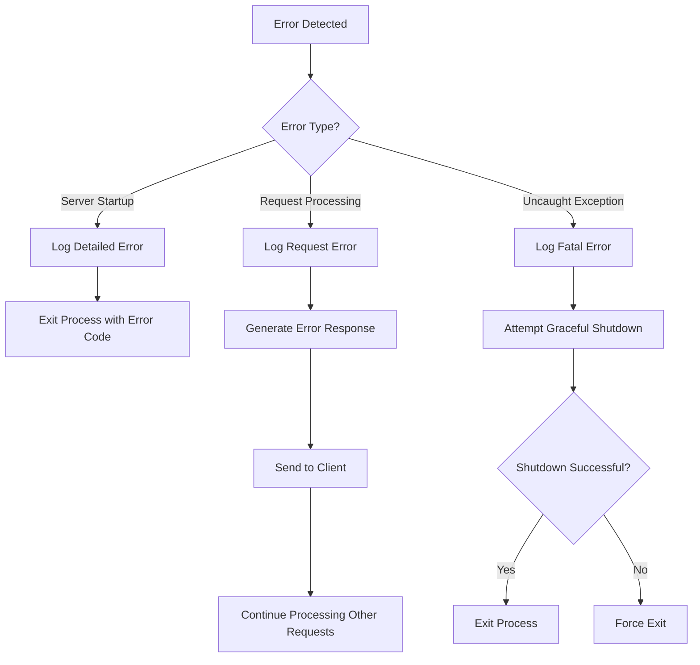
```mermaid
flowchart TD
    A[Error Detected] --> B{Error Type?}
    
    B -->|Server Startup| C[Log Detailed Error]
    C --> D[Exit Process with Error Code]
    
    B -->|Request Processing| E[Log Request Error]
    E --> F[Generate Error Response]
    F --> G[Send to Client]
    G --> H[Continue Processing Other Requests]
    
    B -->|Uncaught Exception| I[Log Fatal Error]
    I --> J[Attempt Graceful Shutdown]
    J --> K{Shutdown Successful?}
    K -->|Yes| L[Exit Process]
    K -->|No| M[Force Exit]
```

**Error Recovery Procedures**

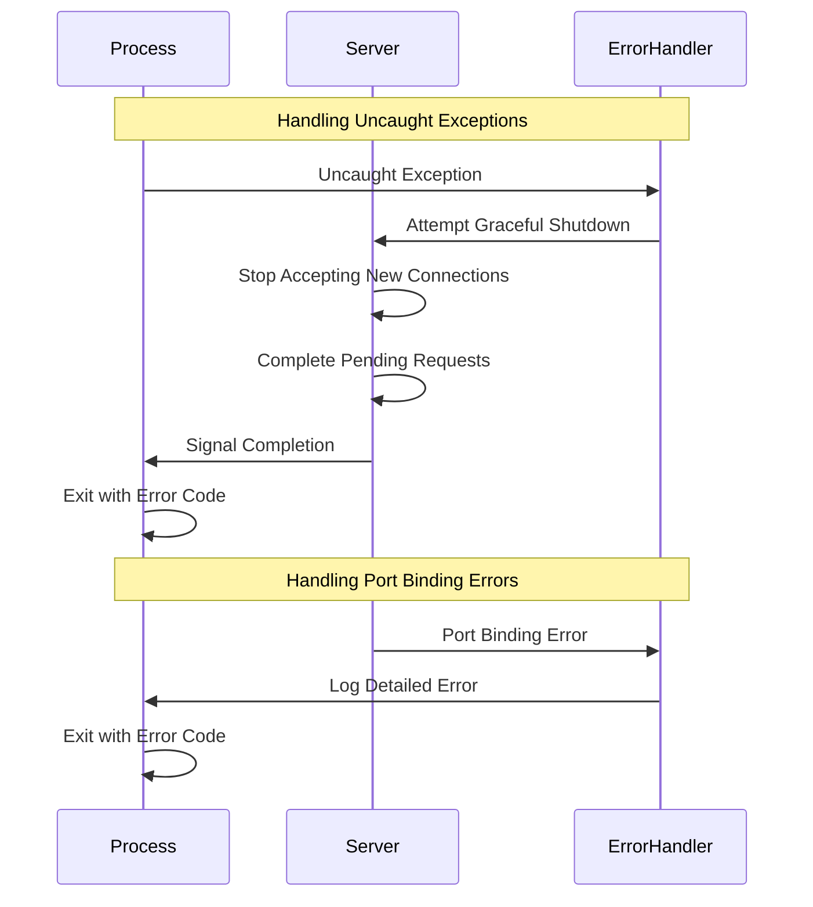
```mermaid
sequenceDiagram
    participant Process
    participant Server
    participant ErrorHandler
    
    Note over Process,ErrorHandler: Handling Uncaught Exceptions
    
    Process->>ErrorHandler: Uncaught Exception
    ErrorHandler->>Server: Attempt Graceful Shutdown
    Server->>Server: Stop Accepting New Connections
    Server->>Server: Complete Pending Requests
    Server->>Process: Signal Completion
    Process->>Process: Exit with Error Code
    
    Note over Process,ErrorHandler: Handling Port Binding Errors
    
    Server->>ErrorHandler: Port Binding Error
    ErrorHandler->>Process: Log Detailed Error
    Process->>Process: Exit with Error Code
```

### REQUIRED DIAGRAMS

#### High-Level System Workflow

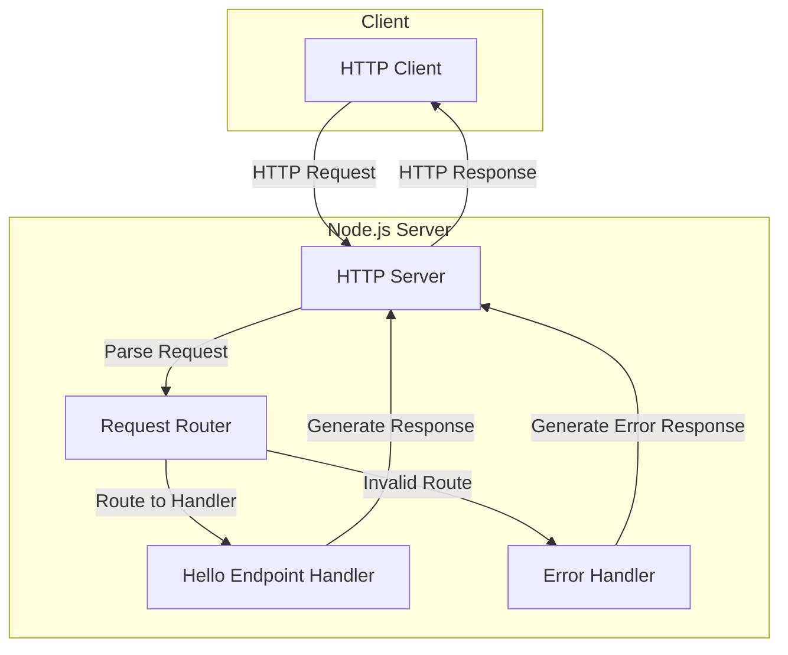
```mermaid
flowchart TD
    subgraph Client
        A[HTTP Client]
    end
    
    subgraph "Node.js Server"
        B[HTTP Server]
        C[Request Router]
        D[Hello Endpoint Handler]
        E[Error Handler]
    end
    
    A -->|HTTP Request| B
    B -->|Parse Request| C
    C -->|Route to Handler| D
    C -->|Invalid Route| E
    D -->|Generate Response| B
    E -->|Generate Error Response| B
    B -->|HTTP Response| A
```

#### Detailed Process Flow for Hello Endpoint

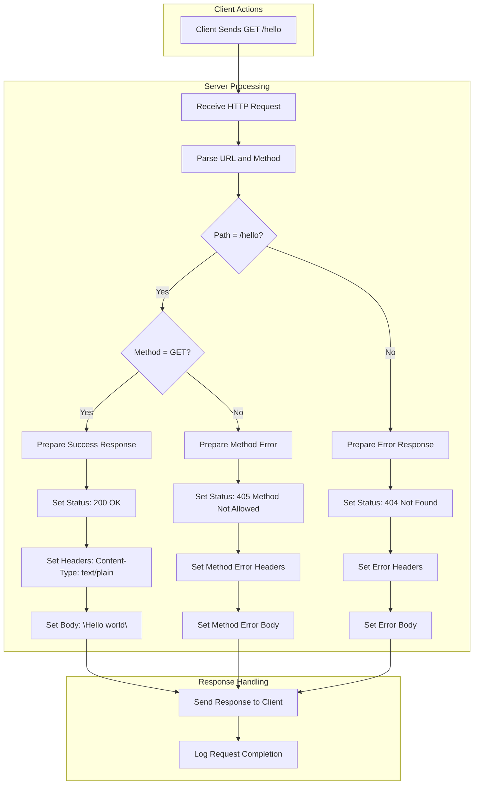
```mermaid
flowchart TD
    subgraph "Client Actions"
        A[Client Sends GET /hello]
    end
    
    subgraph "Server Processing"
        B[Receive HTTP Request]
        C[Parse URL and Method]
        D{Path = /hello?}
        E{Method = GET?}
        F[Prepare Success Response]
        G[Set Status: 200 OK]
        H[Set Headers: Content-Type: text/plain]
        I["Set Body: \"Hello world\""]
        J[Prepare Error Response]
        K[Set Status: 404 Not Found]
        L[Set Error Headers]
        M[Set Error Body]
        N[Prepare Method Error]
        O[Set Status: 405 Method Not Allowed]
        P[Set Method Error Headers]
        Q[Set Method Error Body]
    end
    
    subgraph "Response Handling"
        R[Send Response to Client]
        S[Log Request Completion]
    end
    
    A --> B
    B --> C
    C --> D
    D -->|Yes| E
    D -->|No| J
    E -->|Yes| F
    E -->|No| N
    F --> G
    G --> H
    H --> I
    I --> R
    J --> K
    K --> L
    L --> M
    M --> R
    N --> O
    O --> P
    P --> Q
    Q --> R
    R --> S
```

#### Error Handling Flowchart

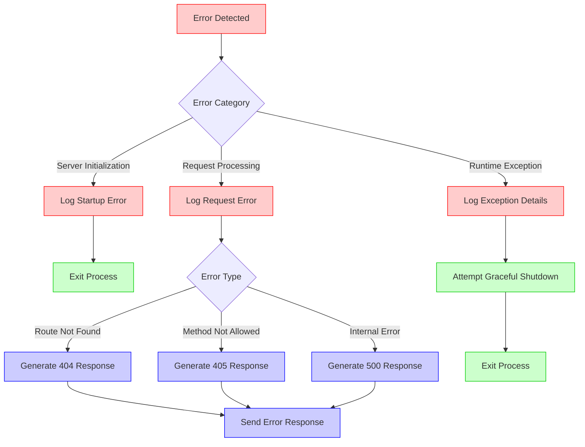
```mermaid
flowchart TD
    A[Error Detected] --> B{Error Category}
    
    B -->|Server Initialization| C[Log Startup Error]
    C --> D[Exit Process]
    
    B -->|Request Processing| E[Log Request Error]
    E --> F{Error Type}
    F -->|Route Not Found| G[Generate 404 Response]
    F -->|Method Not Allowed| H[Generate 405 Response]
    F -->|Internal Error| I[Generate 500 Response]
    G --> J[Send Error Response]
    H --> J
    I --> J
    
    B -->|Runtime Exception| K[Log Exception Details]
    K --> L[Attempt Graceful Shutdown]
    L --> M[Exit Process]
    
    classDef error fill:#ffcccc,stroke:#ff0000
    classDef process fill:#ccffcc,stroke:#00cc00
    classDef response fill:#ccccff,stroke:#0000ff
    
    class A,C,E,K error
    class D,L,M process
    class G,H,I,J response
```

#### Integration Sequence Diagram

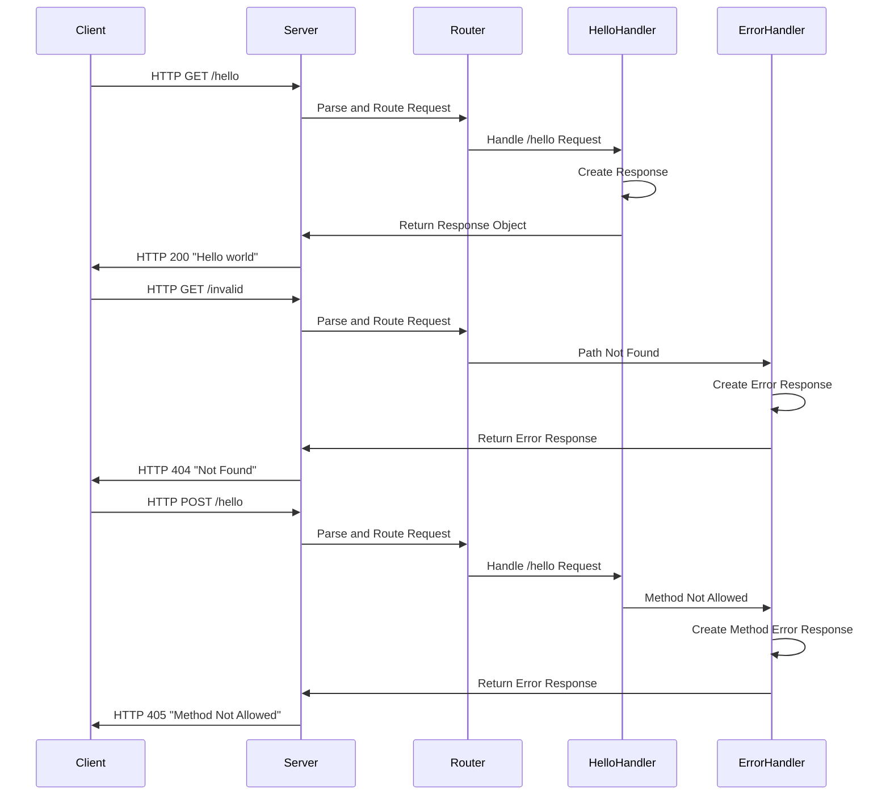
```mermaid
sequenceDiagram
    participant Client
    participant Server
    participant Router
    participant HelloHandler
    participant ErrorHandler
    
    Client->>Server: HTTP GET /hello
    Server->>Router: Parse and Route Request
    Router->>HelloHandler: Handle /hello Request
    HelloHandler->>HelloHandler: Create Response
    HelloHandler->>Server: Return Response Object
    Server->>Client: HTTP 200 "Hello world"
    
    Client->>Server: HTTP GET /invalid
    Server->>Router: Parse and Route Request
    Router->>ErrorHandler: Path Not Found
    ErrorHandler->>ErrorHandler: Create Error Response
    ErrorHandler->>Server: Return Error Response
    Server->>Client: HTTP 404 "Not Found"
    
    Client->>Server: HTTP POST /hello
    Server->>Router: Parse and Route Request
    Router->>HelloHandler: Handle /hello Request
    HelloHandler->>ErrorHandler: Method Not Allowed
    ErrorHandler->>ErrorHandler: Create Method Error Response
    ErrorHandler->>Server: Return Error Response
    Server->>Client: HTTP 405 "Method Not Allowed"
```

#### State Transition Diagram

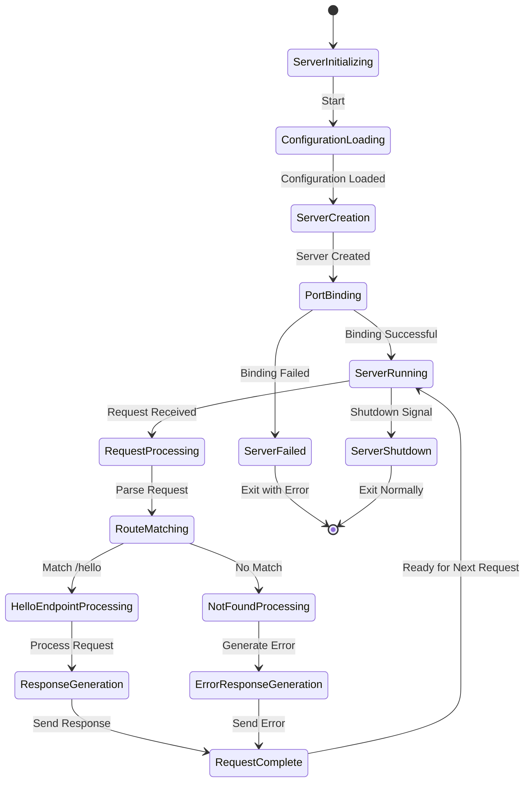
```mermaid
stateDiagram-v2
    [*] --> ServerInitializing
    
    ServerInitializing --> ConfigurationLoading: Start
    ConfigurationLoading --> ServerCreation: Configuration Loaded
    ServerCreation --> PortBinding: Server Created
    PortBinding --> ServerRunning: Binding Successful
    PortBinding --> ServerFailed: Binding Failed
    
    ServerRunning --> RequestProcessing: Request Received
    RequestProcessing --> RouteMatching: Parse Request
    
    RouteMatching --> HelloEndpointProcessing: Match /hello
    RouteMatching --> NotFoundProcessing: No Match
    
    HelloEndpointProcessing --> ResponseGeneration: Process Request
    NotFoundProcessing --> ErrorResponseGeneration: Generate Error
    
    ResponseGeneration --> RequestComplete: Send Response
    ErrorResponseGeneration --> RequestComplete: Send Error
    
    RequestComplete --> ServerRunning: Ready for Next Request
    
    ServerRunning --> ServerShutdown: Shutdown Signal
    ServerFailed --> [*]: Exit with Error
    ServerShutdown --> [*]: Exit Normally
```

## 5. SYSTEM ARCHITECTURE

### HIGH-LEVEL ARCHITECTURE

#### System Overview

The Node.js Hello World service follows a simple, monolithic architecture designed for educational purposes. The system employs:

- **Architectural Style**: Single-process HTTP server using Node.js core modules
- **Key Architectural Principles**:
  - Minimalism: Using only essential components to demonstrate core concepts
  - Modularity: Separating concerns between server creation, request handling, and configuration
  - Statelessness: No session or application state maintained between requests
  - Synchronous processing: Simple request-response cycle without complex asynchronous patterns

- **System Boundaries**:
  - Inbound: HTTP requests from clients
  - Outbound: HTTP responses to clients
  - No external system dependencies or integrations

- **Major Interfaces**:
  - HTTP REST endpoint at `/hello` accepting GET requests
  - Command-line interface for server startup and shutdown

#### Core Components Table

| Component Name | Primary Responsibility | Key Dependencies | Integration Points | Critical Considerations |
|----------------|------------------------|------------------|-------------------|------------------------|
| HTTP Server | Listen for and accept incoming HTTP connections | Node.js HTTP module | Client applications | Port configuration, error handling |
| Request Router | Parse incoming requests and direct to appropriate handler | HTTP Server | Route handlers | URL parsing, method validation |
| Hello Endpoint Handler | Process requests to `/hello` and generate responses | Request Router | HTTP Server | Response formatting, status codes |
| Configuration Manager | Load and validate server configuration | Environment variables | HTTP Server | Default values, validation |
| Error Handler | Process and respond to error conditions | All components | HTTP Server | Consistent error responses, logging |

#### Data Flow Description

The Node.js Hello World service implements a straightforward request-response data flow:

1. **Request Ingestion**: The HTTP Server receives incoming HTTP requests on the configured port.
2. **Request Routing**: The Request Router parses the URL path and HTTP method to determine the appropriate handler.
3. **Request Processing**: For `/hello` path requests, the Hello Endpoint Handler processes the request and generates a response.
4. **Response Generation**: A simple text response with "Hello world" is created with appropriate HTTP headers.
5. **Response Delivery**: The HTTP Server sends the response back to the client.

No persistent data storage is required as the application maintains no state between requests. All processing occurs in-memory within the Node.js process.

#### External Integration Points

| System Name | Integration Type | Data Exchange Pattern | Protocol/Format | SLA Requirements |
|-------------|------------------|------------------------|----------------|------------------|
| HTTP Clients | Inbound | Request-Response | HTTP/Plain Text | Response time < 100ms |

### COMPONENT DETAILS

#### HTTP Server Component

- **Purpose**: Creates and manages the HTTP server that listens for incoming client requests
- **Responsibilities**:
  - Bind to configured network port
  - Accept incoming HTTP connections
  - Parse HTTP requests
  - Route requests to appropriate handlers
  - Send responses back to clients
  - Handle server lifecycle events
- **Technologies**: Node.js core HTTP module
- **Key Interfaces**:
  - `createServer()`: Creates HTTP server instance
  - `listen()`: Binds server to network port
- **Data Persistence**: None required
- **Scaling Considerations**: Single-process design for educational purposes

#### Request Router Component

- **Purpose**: Determines which handler should process each incoming request
- **Responsibilities**:
  - Parse URL paths from incoming requests
  - Validate HTTP methods
  - Route requests to appropriate handlers
  - Generate 404 responses for unknown paths
  - Generate 405 responses for unsupported methods
- **Technologies**: Node.js URL parsing
- **Key Interfaces**:
  - Request handler function that receives (req, res) objects
- **Data Persistence**: None required
- **Scaling Considerations**: Simple in-memory routing with no performance concerns

#### Hello Endpoint Handler Component

- **Purpose**: Process requests to the `/hello` endpoint
- **Responsibilities**:
  - Validate the request method is GET
  - Generate "Hello world" response text
  - Set appropriate HTTP status code (200)
  - Set appropriate content type header
- **Technologies**: Node.js HTTP response methods
- **Key Interfaces**:
  - Handler function that receives (req, res) objects
- **Data Persistence**: None required
- **Scaling Considerations**: Stateless design requires no scaling considerations

#### Configuration Manager Component

- **Purpose**: Load and manage server configuration
- **Responsibilities**:
  - Read environment variables
  - Provide default values when configuration is missing
  - Validate configuration values
- **Technologies**: Node.js process environment
- **Key Interfaces**:
  - Configuration object with server settings
- **Data Persistence**: None required
- **Scaling Considerations**: None, configuration loaded once at startup

#### Error Handler Component

- **Purpose**: Process error conditions consistently
- **Responsibilities**:
  - Handle server startup errors
  - Process request routing errors
  - Generate appropriate HTTP error responses
  - Log error details
- **Technologies**: Node.js error handling patterns
- **Key Interfaces**:
  - Error handling functions for different error types
- **Data Persistence**: None required
- **Scaling Considerations**: None, simple error handling

#### Component Interaction Diagram

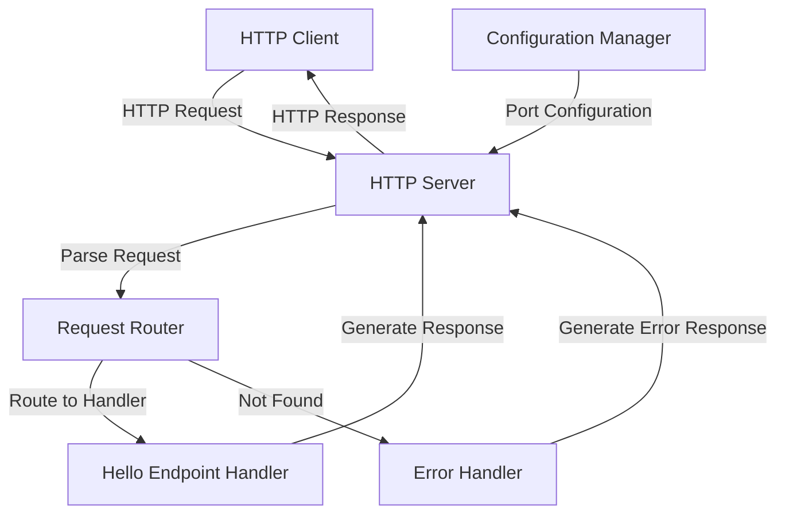
```mermaid
graph TD
    Client[HTTP Client] -->|HTTP Request| Server[HTTP Server]
    Server -->|Parse Request| Router[Request Router]
    Router -->|Route to Handler| HelloHandler[Hello Endpoint Handler]
    Router -->|Not Found| ErrorHandler[Error Handler]
    HelloHandler -->|Generate Response| Server
    ErrorHandler -->|Generate Error Response| Server
    Server -->|HTTP Response| Client
    Config[Configuration Manager] -->|Port Configuration| Server
```

#### Sequence Diagram for Hello Endpoint Request

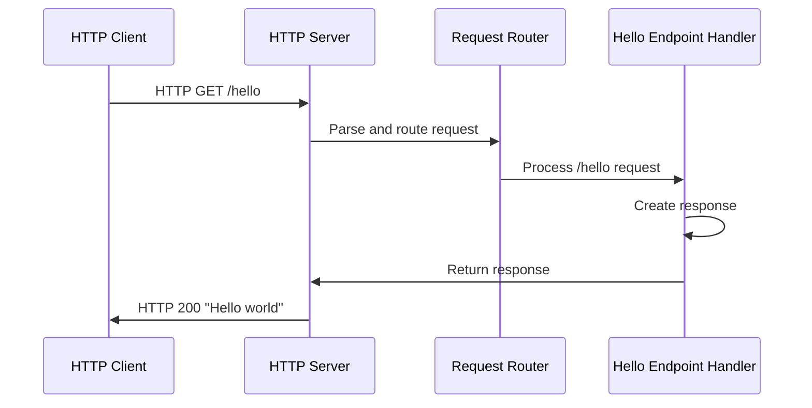
```mermaid
sequenceDiagram
    participant Client as HTTP Client
    participant Server as HTTP Server
    participant Router as Request Router
    participant Handler as Hello Endpoint Handler
    
    Client->>Server: HTTP GET /hello
    Server->>Router: Parse and route request
    Router->>Handler: Process /hello request
    Handler->>Handler: Create response
    Handler->>Server: Return response
    Server->>Client: HTTP 200 "Hello world"
```

#### State Transition Diagram for Server Lifecycle

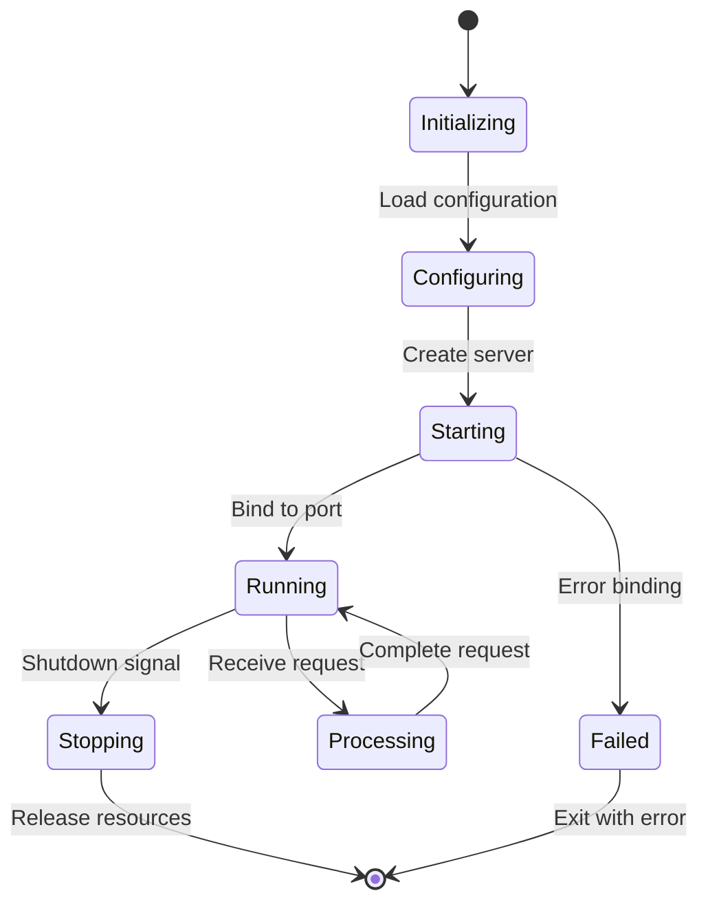
```mermaid
stateDiagram-v2
    [*] --> Initializing
    Initializing --> Configuring: Load configuration
    Configuring --> Starting: Create server
    Starting --> Running: Bind to port
    Starting --> Failed: Error binding
    Running --> Processing: Receive request
    Processing --> Running: Complete request
    Running --> Stopping: Shutdown signal
    Stopping --> [*]: Release resources
    Failed --> [*]: Exit with error
```

### TECHNICAL DECISIONS

#### Architecture Style Decisions

| Decision | Selected Approach | Alternatives Considered | Rationale |
|----------|-------------------|-------------------------|-----------|
| Server Architecture | Single-process HTTP server | Express.js framework, Serverless function | Minimizes dependencies while demonstrating core Node.js concepts |
| Component Organization | Functional separation | Class-based, Microservices | Simplifies understanding for educational purposes |
| Error Handling | Centralized handler | Try/catch in each component | Provides consistent error responses and simplifies maintenance |

The monolithic, single-process architecture was selected to minimize complexity while demonstrating fundamental Node.js HTTP server concepts. This approach:

- Eliminates unnecessary dependencies, focusing on core Node.js capabilities
- Simplifies deployment and execution for educational purposes
- Provides a clear, understandable codebase for learning

#### Communication Pattern Choices

| Pattern | Implementation | Justification |
|---------|----------------|---------------|
| Request-Response | Synchronous HTTP | Simple, standard pattern appropriate for REST endpoints |
| Error Communication | HTTP status codes | Industry standard approach for communicating errors |

The synchronous request-response pattern was selected as it:
- Aligns with HTTP protocol design
- Simplifies the implementation for educational purposes
- Provides immediate feedback to clients

#### Decision Tree for Technology Selection

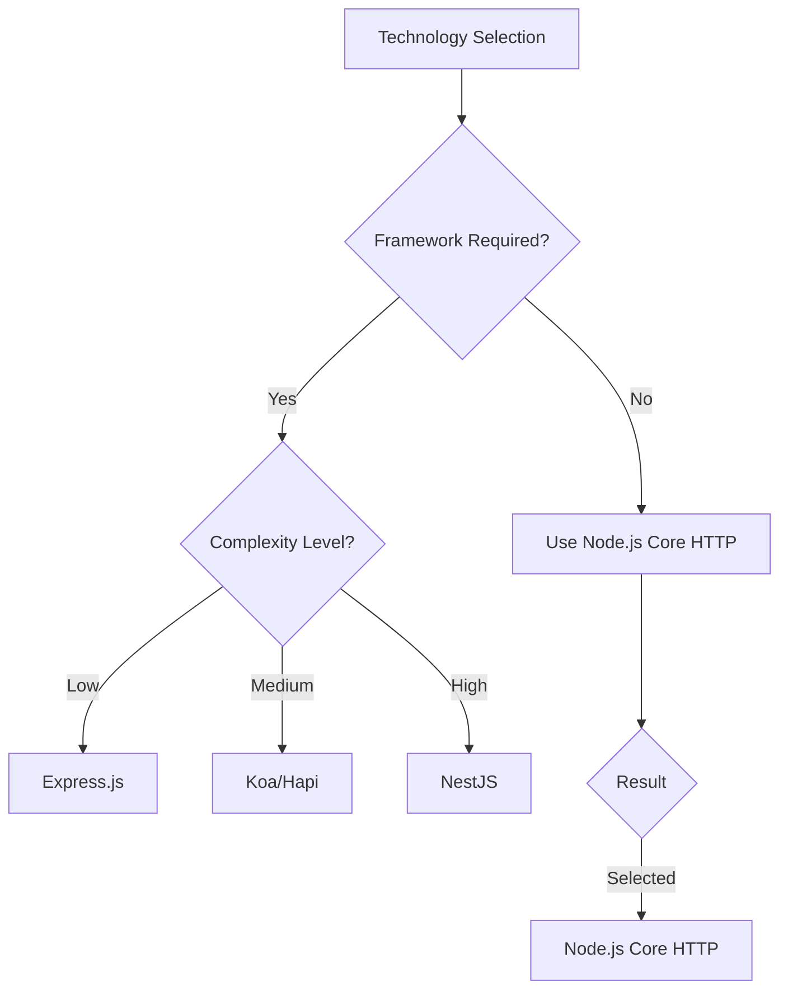
```mermaid
graph TD
    A[Technology Selection] --> B{Framework Required?}
    B -->|No| C[Use Node.js Core HTTP]
    B -->|Yes| D{Complexity Level?}
    D -->|Low| E[Express.js]
    D -->|Medium| F[Koa/Hapi]
    D -->|High| G[NestJS]
    C --> H{Result}
    H -->|Selected| I[Node.js Core HTTP]
```

### CROSS-CUTTING CONCERNS

#### Monitoring and Observability Approach

For this simple educational application, monitoring is limited to basic console logging:

- Server startup events and errors
- Request processing completion
- Unexpected exceptions

In a production environment, additional monitoring would be implemented, but is out of scope for this tutorial project.

#### Logging Strategy

| Log Event Type | Implementation | Purpose |
|----------------|----------------|---------|
| Server Startup | Console log | Confirm server initialization and port |
| Request Completion | Console log | Track request processing |
| Error Events | Console error | Capture and troubleshoot issues |

The logging strategy focuses on providing essential information for educational purposes without introducing complex logging frameworks.

#### Error Handling Patterns

The application implements a simple but comprehensive error handling approach:

- **Server Startup Errors**: Logged to console with descriptive messages, process exits with error code
- **Request Routing Errors**: Generate appropriate HTTP status codes (404, 405) with plain text error messages
- **Unexpected Exceptions**: Caught by global handler, logged to console, attempt graceful shutdown

#### Error Handling Flow

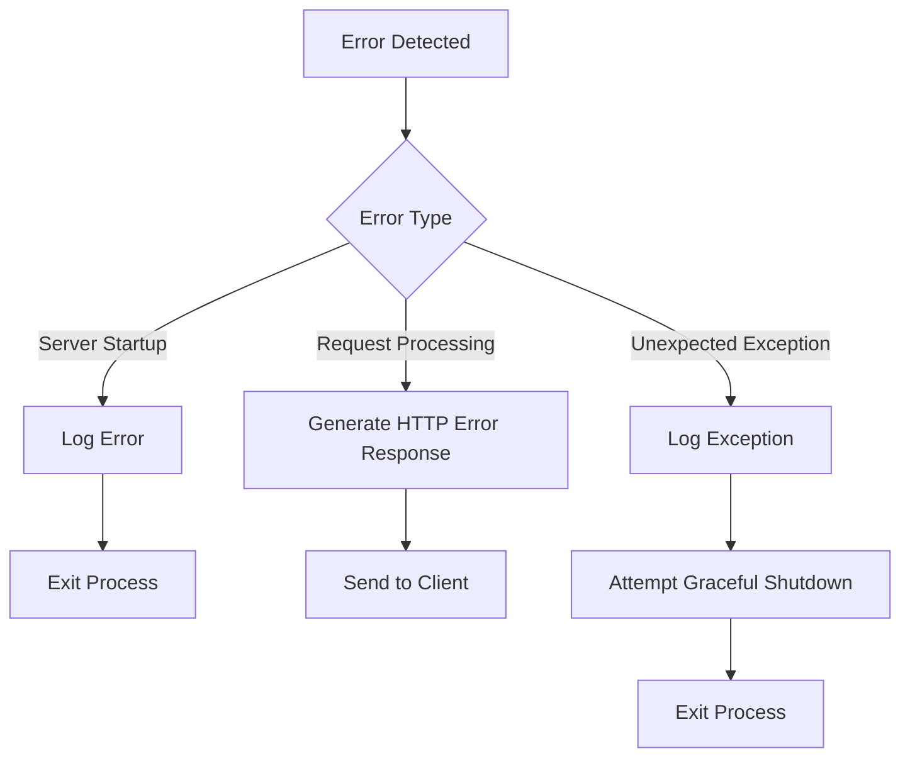
```mermaid
flowchart TD
    A[Error Detected] --> B{Error Type}
    B -->|Server Startup| C[Log Error]
    C --> D[Exit Process]
    B -->|Request Processing| E[Generate HTTP Error Response]
    E --> F[Send to Client]
    B -->|Unexpected Exception| G[Log Exception]
    G --> H[Attempt Graceful Shutdown]
    H --> I[Exit Process]
```

#### Performance Requirements

| Metric | Requirement | Implementation Approach |
|--------|-------------|-------------------------|
| Response Time | < 100ms | Minimal processing logic |
| Startup Time | < 1 second | No complex initialization |
| Resource Usage | Minimal memory footprint | No unnecessary dependencies |

The application's simplicity naturally leads to excellent performance characteristics without requiring specific optimization techniques.

## 6. SYSTEM COMPONENTS DESIGN

### SERVER COMPONENT

#### Component Overview

The Server component is the core of the application, responsible for creating and managing the HTTP server instance that listens for incoming client requests.

| Aspect | Description |
|--------|-------------|
| Primary Responsibility | Create HTTP server, listen on configured port, handle request/response lifecycle |
| Dependencies | Node.js HTTP module, Configuration component |
| Interfaces | HTTP listener, request handler registration |
| State Management | Maintains server instance state (starting, running, error, stopped) |

#### Component Structure

```mermaid
classDiagram
    class Server {
        -httpServer: http.Server
        -port: number
        -running: boolean
        +start(): Promise
        +stop(): Promise
        +registerRoutes(routes): void
        -handleServerError(error): void
    }
    
    class http.Server {
        +listen(port): Server
        +close(): void
        +on(event, callback): Server
    }
    
    Server --> http.Server : uses
```

#### Interface Specifications

**Public Methods:**

| Method | Parameters | Return Type | Description |
|--------|------------|-------------|-------------|
| start() | None | Promise\<void\> | Starts the HTTP server on the configured port |
| stop() | None | Promise\<void\> | Gracefully stops the HTTP server |
| registerRoutes | routes: object | void | Registers route handlers with the server |

**Events:**

| Event | Data | Description |
|-------|------|-------------|
| server.listening | port: number | Emitted when server successfully starts listening |
| server.error | error: Error | Emitted when server encounters an error |
| server.close | None | Emitted when server is shut down |

#### Implementation Details

The Server component will:
1. Create an HTTP server instance using Node.js core HTTP module
2. Configure the server to listen on the specified port
3. Set up error handling for server-level events
4. Register route handlers to process incoming requests
5. Provide methods for starting and stopping the server

**Key Implementation Considerations:**
- Error handling for port binding failures
- Graceful shutdown capability
- Proper event registration and cleanup

### ROUTER COMPONENT

#### Component Overview

The Router component is responsible for parsing incoming HTTP requests and directing them to the appropriate handler based on the URL path and HTTP method.

| Aspect | Description |
|--------|-------------|
| Primary Responsibility | Parse request URLs, match routes, invoke appropriate handlers |
| Dependencies | Server component |
| Interfaces | Route registration, request handling |
| State Management | Stateless - maintains route registry only |

#### Component Structure

```mermaid
classDiagram
    class Router {
        -routes: Map
        +register(path, method, handler): void
        +handleRequest(req, res): void
        -matchRoute(path, method): RouteHandler
        -handleNotFound(req, res): void
        -handleMethodNotAllowed(req, res): void
    }
    
    class RouteHandler {
        <<interface>>
        +handle(req, res): void
    }
    
    Router --> RouteHandler : invokes
```

#### Interface Specifications

**Public Methods:**

| Method | Parameters | Return Type | Description |
|--------|------------|-------------|-------------|
| register | path: string, method: string, handler: function | void | Registers a handler for a specific path and HTTP method |
| handleRequest | req: http.IncomingMessage, res: http.ServerResponse | void | Processes an incoming HTTP request |

**Route Handler Interface:**

| Method | Parameters | Return Type | Description |
|--------|------------|-------------|-------------|
| handle | req: http.IncomingMessage, res: http.ServerResponse | void | Processes a specific route request |

#### Implementation Details

The Router component will:
1. Maintain a registry of route handlers mapped by path and HTTP method
2. Parse incoming request URLs to extract the path
3. Match the path and method against registered routes
4. Invoke the matching handler or return appropriate error responses
5. Handle 404 (Not Found) and 405 (Method Not Allowed) conditions

**Key Implementation Considerations:**
- Efficient route matching algorithm
- Proper HTTP method validation
- Consistent error response generation

### HELLO ENDPOINT COMPONENT

#### Component Overview

The Hello Endpoint component implements the specific handler for the `/hello` path, generating the "Hello world" response.

| Aspect | Description |
|--------|-------------|
| Primary Responsibility | Process requests to `/hello` path and generate responses |
| Dependencies | Router component |
| Interfaces | Route handler interface |
| State Management | Stateless |

#### Component Structure

```mermaid
classDiagram
    class HelloEndpointHandler {
        +handle(req, res): void
        -validateMethod(method): boolean
        -createResponse(res): void
        -handleInvalidMethod(res): void
    }
    
    class RouteHandler {
        <<interface>>
        +handle(req, res): void
    }
    
    HelloEndpointHandler ..|> RouteHandler : implements
```

#### Interface Specifications

**Public Methods:**

| Method | Parameters | Return Type | Description |
|--------|------------|-------------|-------------|
| handle | req: http.IncomingMessage, res: http.ServerResponse | void | Processes a request to the `/hello` endpoint |

**Response Format:**

| Status Code | Content-Type | Body | Condition |
|-------------|--------------|------|-----------|
| 200 | text/plain | "Hello world" | GET request to `/hello` |
| 405 | text/plain | "Method Not Allowed" | Non-GET request to `/hello` |

#### Implementation Details

The Hello Endpoint component will:
1. Validate that the request uses the GET method
2. For valid GET requests, set the response status to 200
3. Set the Content-Type header to "text/plain"
4. Set the response body to "Hello world"
5. For invalid methods, return a 405 Method Not Allowed response

**Key Implementation Considerations:**
- Proper HTTP header setting
- Method validation
- Consistent response formatting

### CONFIGURATION COMPONENT

#### Component Overview

The Configuration component is responsible for loading and managing server configuration settings, particularly the port number.

| Aspect | Description |
|--------|-------------|
| Primary Responsibility | Load configuration from environment, provide defaults, validate settings |
| Dependencies | None |
| Interfaces | Configuration retrieval |
| State Management | Immutable configuration object |

#### Component Structure

```mermaid
classDiagram
    class Configuration {
        -port: number
        +load(): void
        +getPort(): number
        -validatePort(port): number
        -loadFromEnvironment(): object
    }
```

#### Interface Specifications

**Public Methods:**

| Method | Parameters | Return Type | Description |
|--------|------------|-------------|-------------|
| load | None | void | Loads configuration from environment variables |
| getPort | None | number | Returns the configured port number |

**Configuration Parameters:**

| Parameter | Environment Variable | Default | Validation |
|-----------|----------------------|---------|------------|
| port | PORT | 3000 | Integer between 1024-65535 |

#### Implementation Details

The Configuration component will:
1. Read configuration from environment variables
2. Apply default values for missing configuration
3. Validate configuration values
4. Provide access to configuration through getter methods

**Key Implementation Considerations:**
- Environment variable access
- Type conversion and validation
- Sensible defaults

### ERROR HANDLER COMPONENT

#### Component Overview

The Error Handler component provides centralized error handling for the application, ensuring consistent error responses and logging.

| Aspect | Description |
|--------|-------------|
| Primary Responsibility | Process errors, generate error responses, log error details |
| Dependencies | None |
| Interfaces | Error handling methods |
| State Management | Stateless |

#### Component Structure

```mermaid
classDiagram
    class ErrorHandler {
        +handleServerError(error): void
        +handleRouteNotFound(req, res): void
        +handleMethodNotAllowed(req, res): void
        +handleUncaughtException(error): void
        -logError(error, context): void
        -sendErrorResponse(res, status, message): void
    }
```

#### Interface Specifications

**Public Methods:**

| Method | Parameters | Return Type | Description |
|--------|------------|-------------|-------------|
| handleServerError | error: Error | void | Handles server startup and runtime errors |
| handleRouteNotFound | req: http.IncomingMessage, res: http.ServerResponse | void | Generates 404 Not Found responses |
| handleMethodNotAllowed | req: http.IncomingMessage, res: http.ServerResponse | void | Generates 405 Method Not Allowed responses |
| handleUncaughtException | error: Error | void | Handles uncaught exceptions |

**Error Response Format:**

| Error Type | Status Code | Content-Type | Body Format |
|------------|-------------|--------------|-------------|
| Not Found | 404 | text/plain | "Not Found" |
| Method Not Allowed | 405 | text/plain | "Method Not Allowed" |
| Server Error | 500 | text/plain | "Internal Server Error" |

#### Implementation Details

The Error Handler component will:
1. Provide specialized handlers for different error types
2. Generate appropriate HTTP error responses
3. Log error details to the console
4. Handle process-level uncaught exceptions

**Key Implementation Considerations:**
- Consistent error response formatting
- Appropriate error logging
- Process exit handling for fatal errors

### COMPONENT INTERACTIONS

#### Interaction Diagram

```mermaid
sequenceDiagram
    participant Client
    participant Server
    participant Router
    participant HelloHandler
    participant ErrorHandler
    participant Config
    
    Config->>Server: Provide port configuration
    Server->>Router: Register for request handling
    Router->>HelloHandler: Register /hello endpoint
    
    Client->>Server: HTTP GET /hello
    Server->>Router: Forward request
    Router->>HelloHandler: Route to handler
    HelloHandler->>Client: Return "Hello world"
    
    Client->>Server: HTTP GET /unknown
    Server->>Router: Forward request
    Router->>ErrorHandler: Not Found
    ErrorHandler->>Client: Return 404 response
    
    Client->>Server: HTTP POST /hello
    Server->>Router: Forward request
    Router->>HelloHandler: Route to handler
    HelloHandler->>ErrorHandler: Method Not Allowed
    ErrorHandler->>Client: Return 405 response
```

#### Component Dependencies

```mermaid
graph TD
    A[Server Component] --> B[Node.js HTTP Module]
    A --> C[Configuration Component]
    A --> D[Router Component]
    D --> E[Hello Endpoint Component]
    D --> F[Error Handler Component]
    E --> F
```

#### Startup Sequence

```mermaid
sequenceDiagram
    participant Main
    participant Config
    participant Server
    participant Router
    participant HelloHandler
    participant ErrorHandler
    
    Main->>Config: Load configuration
    Config->>Main: Return configuration
    Main->>Server: Create server
    Main->>Router: Create router
    Main->>HelloHandler: Create handler
    Main->>ErrorHandler: Create error handler
    
    Main->>Router: Register hello endpoint
    Router->>HelloHandler: Store handler reference
    
    Main->>Server: Register router
    Server->>Router: Store router reference
    
    Main->>Server: Start server
    Server->>Main: Server started event
    
    Note over Main: Application ready
```

### COMPONENT DESIGN DECISIONS

#### Design Patterns Used

| Pattern | Component | Justification |
|---------|-----------|---------------|
| Singleton | Configuration | Single source of configuration settings |
| Factory | Server | Creates and configures HTTP server instance |
| Strategy | Router | Different handlers for different routes |
| Observer | Server | Event-based communication for server lifecycle |

#### Alternative Approaches Considered

| Component | Alternative Approach | Reason for Rejection |
|-----------|----------------------|----------------------|
| Router | Express.js Router | Adds unnecessary dependency for simple routing |
| Server | Class-based implementation | Functional approach is simpler for educational purposes |
| Configuration | Configuration file | Environment variables are simpler for a tutorial |

#### Extensibility Points

| Component | Extensibility Mechanism | Potential Extensions |
|-----------|--------------------------|----------------------|
| Router | Route registration API | Additional endpoints, middleware support |
| Server | Event listeners | Custom server lifecycle hooks |
| Configuration | Additional parameters | Extended configuration options |

### COMPONENT TESTING APPROACH

#### Unit Testing Strategy

| Component | Test Focus | Mock Dependencies |
|-----------|------------|-------------------|
| Server | Server lifecycle, error handling | HTTP module, Configuration |
| Router | Route matching, handler invocation | Request/Response objects |
| Hello Endpoint | Response generation, method validation | Request/Response objects |
| Configuration | Environment loading, validation | Environment variables |
| Error Handler | Error response generation | Request/Response objects |

#### Integration Testing Strategy

| Test Scenario | Components Involved | Validation Criteria |
|---------------|---------------------|---------------------|
| Server startup | Server, Configuration | Server listens on correct port |
| Hello endpoint request | Server, Router, Hello Endpoint | Returns "Hello world" with 200 status |
| Invalid path request | Server, Router, Error Handler | Returns 404 Not Found |
| Invalid method request | Server, Router, Hello Endpoint, Error Handler | Returns 405 Method Not Allowed |

#### Test Data Requirements

| Test Case | Input Data | Expected Output |
|-----------|------------|----------------|
| Valid hello request | GET /hello | 200 "Hello world" |
| Invalid path | GET /unknown | 404 "Not Found" |
| Invalid method | POST /hello | 405 "Method Not Allowed" |
| Server error simulation | Bind to in-use port | Error log, process exit |

### 6.1 CORE SERVICES ARCHITECTURE

Core Services Architecture is not applicable for this system in its traditional sense. This Node.js Hello World application is intentionally designed as a simple, monolithic application with minimal complexity for educational purposes. The system consists of a single process running on a single server with no distributed components or microservices.

#### Justification for Non-Applicability

| Aspect | Explanation |
|--------|-------------|
| System Scale | The application is a minimal HTTP server with a single endpoint |
| Complexity Level | Deliberately simplified for educational purposes |
| Deployment Model | Single-process, single-server deployment |
| Integration Requirements | No external service dependencies or integrations |

Instead of a distributed architecture, this system employs a simple, modular design within a single process:

```mermaid
graph TD
    subgraph "Single Node.js Process"
        A[HTTP Server Module] --> B[Request Router]
        B --> C[Hello Endpoint Handler]
        B --> D[Error Handler]
        E[Configuration Module] --> A
    end
    F[HTTP Client] <--> A
```

#### Alternative Considerations for Future Scaling

While not required for the current implementation, the following approaches could be considered if the system needed to scale in the future:

| Scaling Approach | Implementation Method | When to Consider |
|------------------|------------------------|------------------|
| Load Balancing | Simple HTTP load balancer (e.g., Nginx) | When handling increased traffic |
| Process Clustering | Node.js Cluster module | To utilize multiple CPU cores |
| Containerization | Docker with simple orchestration | For deployment consistency |

#### Simplified Resilience Approach

For this educational application, resilience is addressed through basic error handling rather than complex patterns:

```mermaid
flowchart TD
    A[Error Detection] --> B{Error Type}
    B -->|Server Startup| C[Log Error]
    C --> D[Exit Process]
    B -->|Request Processing| E[Generate Error Response]
    E --> F[Continue Serving]
    B -->|Uncaught Exception| G[Log Fatal Error]
    G --> H[Graceful Shutdown]
```

#### Performance Considerations

Despite the simplified architecture, the application maintains these performance characteristics:

| Aspect | Approach | Benefit |
|--------|----------|---------|
| Memory Usage | Minimal dependencies | Low resource footprint |
| Response Time | Direct request handling | Fast response generation |
| Startup Time | Simple initialization | Quick deployment and restart |

This architectural approach aligns with the educational goals of the project by focusing on clarity and simplicity rather than distributed systems concepts that would add unnecessary complexity.

### 6.2 DATABASE DESIGN

Database Design is not applicable to this system. The Node.js Hello World application with a single `/hello` endpoint that returns "Hello world" does not require any persistent data storage for the following reasons:

#### Justification for Non-Applicability

| Aspect | Explanation |
|--------|-------------|
| Data Requirements | The application serves static content ("Hello world") with no dynamic data needs |
| State Management | The application is completely stateless, requiring no persistence between requests |
| Functionality | The single endpoint performs no data operations (create, read, update, delete) |
| System Complexity | Designed as a minimal educational example without data persistence requirements |

#### Alternative Approaches

If data persistence were to be added in future iterations, the following approaches could be considered:

| Approach | Use Case | Implementation Complexity |
|----------|----------|---------------------------|
| File-based Storage | Simple logging, configuration | Low |
| In-memory Cache | Request counting, rate limiting | Low |
| NoSQL Database | Unstructured data collection | Medium |
| Relational Database | Structured data with relationships | Medium-High |

#### Data Flow Without Persistence

The current application implements a simple request-response flow without data persistence:

```mermaid
flowchart LR
    Client[HTTP Client] -->|HTTP Request| Server[Node.js Server]
    Server -->|Process Request| Handler[Hello Handler]
    Handler -->|Generate Response| Server
    Server -->|HTTP Response| Client
    
    Note[No data persistence required]
    Handler -.-> Note
    style Note fill:#ffffde,stroke:#aaaa33,stroke-dasharray: 5 5
```

#### Memory Considerations

Although the system doesn't use persistent storage, it does utilize memory resources:

| Resource Type | Usage | Lifecycle |
|---------------|-------|-----------|
| HTTP Server | Node.js HTTP server instance | Application lifetime |
| Request Objects | HTTP request data | Request duration |
| Response Objects | HTTP response data | Request duration |

#### Future Extensibility

If the application were to be extended to include data persistence in the future, the following considerations would become relevant:

| Consideration | Approach | Implementation Notes |
|---------------|----------|---------------------|
| Data Models | Start with simple schema | Define clear entities and relationships |
| Storage Selection | Choose based on data structure | Consider NoSQL for flexibility, SQL for relationships |
| Connection Management | Implement connection pooling | Optimize for concurrent requests |
| Error Handling | Robust database error handling | Graceful fallbacks for database failures |

The current implementation intentionally avoids database dependencies to maintain simplicity and focus on the core HTTP server functionality, which aligns with the educational purpose of the application.

### 6.3 INTEGRATION ARCHITECTURE

Integration Architecture is not applicable for this system in its traditional sense. The Node.js Hello World application is intentionally designed as a standalone educational example with minimal complexity and no external dependencies.

#### Justification for Non-Applicability

| Aspect | Explanation |
|--------|-------------|
| System Purpose | Educational demonstration of a basic HTTP server |
| External Dependencies | None - system operates independently |
| Integration Requirements | No integration with external systems or services |
| Data Exchange Needs | No data exchange beyond simple HTTP request/response |

The application implements a single HTTP endpoint that returns static content without requiring any external system integration. All functionality is self-contained within the Node.js process.

#### Simplified HTTP Interface

While not a complex integration architecture, the system does expose a minimal HTTP interface:

```mermaid
sequenceDiagram
    participant Client as HTTP Client
    participant Server as Node.js Server
    participant Handler as Hello Endpoint Handler
    
    Client->>Server: HTTP GET /hello
    Server->>Handler: Route request
    Handler->>Server: Return "Hello world" response
    Server->>Client: HTTP 200 "Hello world"
```

#### API Specification

For completeness, the minimal API is documented below:

| Endpoint | Method | Response | Content-Type |
|----------|--------|----------|-------------|
| /hello | GET | "Hello world" | text/plain |

#### Future Integration Considerations

If the application were to be extended in the future, the following integration approaches could be considered:

| Integration Type | Potential Implementation | When to Consider |
|------------------|--------------------------|------------------|
| API Extensions | Additional REST endpoints | For expanded functionality |
| Authentication | Basic Auth or JWT | If access control needed |
| External Services | HTTP clients to third-party APIs | For enhanced capabilities |

#### Simplified Integration Flow

The current system implements this minimal integration flow:

```mermaid
graph LR
    A[HTTP Client] <-->|HTTP Request/Response| B[Node.js Server]
    
    style B fill:#d0f0d0,stroke:#007700
    style A fill:#d0d0f0,stroke:#000077
```

This architectural approach aligns with the educational goals of the project by focusing on clarity and simplicity rather than complex integration patterns that would add unnecessary complexity for a basic Hello World example.

### 6.4 SECURITY ARCHITECTURE

Detailed Security Architecture is not applicable for this system. The Node.js Hello World application is intentionally designed as a minimal educational example with a single endpoint that returns static content. The application does not:

- Store or process sensitive data
- Require user authentication or authorization
- Implement user sessions or account management
- Connect to databases or external services
- Process or transmit personally identifiable information

#### Standard Security Practices

Although a comprehensive security architecture is not required, the following standard security practices will be implemented:

| Security Practice | Implementation Approach | Purpose |
|-------------------|--------------------------|---------|
| Input Validation | Validate HTTP method and path | Prevent unexpected behavior from malformed requests |
| Error Handling | Avoid exposing system details in errors | Prevent information disclosure |
| HTTP Headers | Set appropriate content-type headers | Ensure proper content interpretation |
| Logging | Minimal logging without sensitive data | Enable basic troubleshooting |

#### Security Considerations for Educational Use

```mermaid
flowchart TD
    A[Client Request] --> B{Input Validation}
    B -->|Valid| C[Process Request]
    B -->|Invalid| D[Return Error]
    C --> E[Generate Response]
    D --> E
    E --> F[Set Headers]
    F --> G[Return Response]
    
    style B fill:#ffe6e6,stroke:#ff0000
    style D fill:#ffe6e6,stroke:#ff0000
    style F fill:#ffe6e6,stroke:#ff0000
```

#### Security Recommendations for Production Use

While not implemented in this educational example, the following security measures should be considered if adapting this code for production use:

| Security Measure | Recommendation | Implementation Complexity |
|------------------|----------------|---------------------------|
| HTTPS | Implement TLS/SSL for all communications | Low |
| Rate Limiting | Add request throttling to prevent abuse | Medium |
| Helmet.js | Add security headers for Node.js applications | Low |
| Logging | Implement structured logging with appropriate levels | Medium |

#### Security Zone Simplification

For this minimal application, the security zone model is greatly simplified:

```mermaid
graph TD
    subgraph "Public Network"
        A[HTTP Client]
    end
    
    subgraph "Application Zone"
        B[Node.js Server]
        C[Hello Endpoint]
    end
    
    A <-->|HTTP Request/Response| B
    B <--> C
    
    style A fill:#d0d0f0,stroke:#000077
    style B fill:#d0f0d0,stroke:#007700
    style C fill:#d0f0d0,stroke:#007700
```

#### Security Control Matrix

| Control Category | Control Status | Notes |
|------------------|----------------|-------|
| Authentication | Not Applicable | No user identity management required |
| Authorization | Not Applicable | No access control required |
| Data Protection | Minimal | No sensitive data processed |
| Input Validation | Basic | HTTP method and path validation |
| Output Encoding | Basic | Proper content-type headers |
| Logging & Monitoring | Minimal | Basic console logging only |

This simplified security approach aligns with the educational goals of the project while acknowledging that additional security measures would be required for any production deployment.

### 6.5 MONITORING AND OBSERVABILITY

Detailed Monitoring Architecture is not applicable for this system. The Node.js Hello World application is intentionally designed as a minimal educational example with a single endpoint that returns static content. The application has:

- No complex infrastructure components
- No distributed services requiring coordination
- No data persistence layer to monitor
- No authentication or authorization mechanisms
- No business-critical operations requiring SLA enforcement

#### Basic Monitoring Practices

Although comprehensive monitoring is not required, the following basic monitoring practices will be implemented:

| Monitoring Practice | Implementation Approach | Purpose |
|---------------------|--------------------------|---------|
| Console Logging | Log server startup and requests | Provide basic visibility into application operation |
| Error Tracking | Log errors to console with stack traces | Enable basic troubleshooting |
| Health Endpoint | Optional `/health` endpoint returning status | Allow basic availability checking |
| Process Monitoring | Standard Node.js process monitoring | Track basic resource usage |

#### Simplified Health Check Implementation

```mermaid
flowchart TD
    A[HTTP Client] -->|GET /health| B[Node.js Server]
    B --> C{Server Status}
    C -->|Healthy| D[Return 200 OK]
    C -->|Unhealthy| E[Return 503 Service Unavailable]
    D --> F[HTTP Response]
    E --> F
    F --> A
```

#### Basic Metrics Collection

For educational purposes, the following minimal metrics could be tracked:

| Metric | Description | Collection Method | Purpose |
|--------|-------------|-------------------|---------|
| Request Count | Total number of requests | In-memory counter | Basic traffic monitoring |
| Response Time | Time to process requests | Timer around handler | Basic performance tracking |
| Error Count | Number of failed requests | Error event counter | Basic reliability monitoring |
| Server Uptime | Time since server start | Start timestamp | Basic availability tracking |

#### Simple Logging Strategy

```mermaid
flowchart LR
    A[Request] --> B[Request Logger]
    B --> C[Request Handler]
    C --> D[Response Logger]
    D --> E[Response]
    
    F[Server Events] --> G[Event Logger]
    H[Errors] --> I[Error Logger]
    
    B --> J[Console Output]
    D --> J
    G --> J
    I --> J
```

#### Recommendations for Production Use

While not implemented in this educational example, the following monitoring enhancements should be considered if adapting this code for production use:

| Monitoring Enhancement | Recommendation | Implementation Complexity |
|------------------------|----------------|---------------------------|
| Structured Logging | Implement JSON logging with Winston or Pino | Low |
| Metrics Exposure | Add Prometheus metrics endpoint | Medium |
| Health Checks | Implement detailed health check with dependencies | Low |
| APM Integration | Add New Relic, Datadog, or similar APM tool | Medium |
| Log Aggregation | Send logs to centralized system (ELK, Graylog) | Medium |

#### Basic Health Check Response

For the optional health endpoint, a simple JSON response format could be used:

| Field | Type | Description | Example |
|-------|------|-------------|---------|
| status | string | Overall health status | "healthy" |
| uptime | number | Seconds since startup | 3600 |
| timestamp | string | ISO timestamp | "2023-07-01T12:00:00Z" |
| version | string | Application version | "1.0.0" |

This simplified monitoring approach aligns with the educational goals of the project while acknowledging that additional monitoring would be required for any production deployment.

### 6.6 TESTING STRATEGY

While a comprehensive testing strategy is not required for this simple Node.js Hello World application, a basic testing approach will be implemented to ensure reliability and demonstrate good development practices.

#### TESTING APPROACH

##### Unit Testing

| Aspect | Description |
|--------|-------------|
| Testing Framework | Jest - lightweight JavaScript testing framework with built-in assertion library and mocking capabilities |
| Test Structure | Tests organized by component (server, router, hello-endpoint, error-handler) |
| File Organization | Test files located in `__tests__` directory with naming pattern `[component-name].test.js` |
| Mocking Strategy | HTTP requests/responses mocked using Jest mock functions |

**Test Organization Structure:**

```
project-root/
├── __tests__/
│   ├── server.test.js
│   ├── router.test.js
│   ├── hello-endpoint.test.js
│   └── error-handler.test.js
├── src/
│   ├── server.js
│   ├── router.js
│   ├── hello-endpoint.js
│   └── error-handler.js
└── package.json
```

**Mocking Strategy:**

| Component | Mocking Approach | Purpose |
|-----------|------------------|---------|
| HTTP Server | Mock `http.createServer` and `server.listen` | Test server initialization without binding to ports |
| Request/Response | Mock request/response objects with required methods | Test route handlers without HTTP connections |
| Configuration | Mock environment variables | Test configuration loading with controlled values |

**Code Coverage Requirements:**

| Component | Coverage Target | Critical Paths |
|-----------|-----------------|---------------|
| Server | 90% | Server creation, error handling |
| Router | 90% | Route matching, handler invocation |
| Hello Endpoint | 100% | Response generation, method validation |
| Error Handler | 90% | Error response generation |

**Example Test Pattern:**

```mermaid
flowchart TD
    A[Setup Test] --> B[Mock Dependencies]
    B --> C[Execute Function Under Test]
    C --> D[Assert Expected Behavior]
    D --> E[Verify Mocks Called Correctly]
```

##### Integration Testing

| Aspect | Description |
|--------|-------------|
| Testing Approach | Supertest for HTTP endpoint testing |
| Test Focus | End-to-end request/response cycle without mocking |
| Test Data | No external data dependencies required |
| Environment | In-memory server instance with random port |

**API Testing Strategy:**

| Test Scenario | Validation Criteria |
|---------------|---------------------|
| GET /hello | Status 200, body "Hello world", content-type text/plain |
| POST /hello | Status 405, Method Not Allowed |
| GET /unknown | Status 404, Not Found |

**Test Environment Management:**

```mermaid
flowchart TD
    A[Start Test Suite] --> B[Create Server Instance]
    B --> C[Bind to Random Port]
    C --> D[Run Test Cases]
    D --> E[Close Server]
    E --> F[Complete Test Suite]
```

#### TEST AUTOMATION

| Aspect | Implementation |
|--------|---------------|
| CI/CD Integration | GitHub Actions for automated testing |
| Test Triggers | Pull requests, commits to main branch |
| Test Reporting | Jest's built-in reporter with GitHub Actions integration |
| Failed Test Handling | Fail CI pipeline, provide detailed error reports |

**Automated Test Flow:**

```mermaid
flowchart TD
    A[Code Push] --> B[GitHub Actions Trigger]
    B --> C[Install Dependencies]
    C --> D[Run Linter]
    D --> E[Run Unit Tests]
    E --> F[Run Integration Tests]
    F --> G{All Tests Pass?}
    G -->|Yes| H[Mark Build Success]
    G -->|No| I[Mark Build Failed]
    I --> J[Notify Developer]
    H --> K[Ready for Review/Merge]
```

#### QUALITY METRICS

| Metric | Target | Enforcement |
|--------|--------|-------------|
| Code Coverage | 90% overall | Enforced in CI pipeline |
| Test Success Rate | 100% | Required for merge |
| Linting | 0 errors | Enforced in CI pipeline |
| Documentation | All public functions documented | Manual review |

**Quality Gates:**

```mermaid
flowchart TD
    A[Pull Request] --> B{Linting Passed?}
    B -->|No| C[Fix Linting Issues]
    B -->|Yes| D{Tests Passing?}
    D -->|No| E[Fix Failing Tests]
    D -->|Yes| F{Coverage Target Met?}
    F -->|No| G[Add Missing Tests]
    F -->|Yes| H[Ready for Review]
    
    C --> A
    E --> A
    G --> A
```

#### TEST ENVIRONMENT ARCHITECTURE

```mermaid
graph TD
    subgraph "Local Development"
        A[Developer Machine]
        B[Jest Test Runner]
        C[In-Memory HTTP Server]
        D[Supertest HTTP Client]
    end
    
    subgraph "CI Environment"
        E[GitHub Actions Runner]
        F[Node.js Environment]
        G[Jest + Coverage Reporter]
        H[Test Results]
    end
    
    A --> B
    B --> C
    D --> C
    
    E --> F
    F --> G
    G --> H
```

#### EXAMPLE TEST CASES

| Component | Test Case | Assertion |
|-----------|-----------|-----------|
| Server | Server starts successfully | Server listening event triggered |
| Server | Server handles port binding error | Error logged, process exits |
| Router | Router matches /hello path | Hello handler invoked |
| Router | Router handles unknown path | 404 handler invoked |
| Hello Endpoint | GET /hello returns correct response | Status 200, body "Hello world" |
| Hello Endpoint | POST /hello returns method error | Status 405, Method Not Allowed |
| Error Handler | Not found generates correct response | Status 404, Not Found message |

#### TESTING TOOLS SUMMARY

| Tool | Version | Purpose |
|------|---------|---------|
| Jest | 29.x | Unit testing framework |
| Supertest | 6.x | HTTP integration testing |
| GitHub Actions | N/A | CI/CD automation |
| Jest Coverage | Built-in | Code coverage reporting |

#### TEST DATA FLOW

```mermaid
flowchart LR
    A[Test Case] --> B[Test Setup]
    B --> C[Create Mock Request]
    C --> D[Execute Handler]
    D --> E[Capture Response]
    E --> F[Assert Results]
    
    G[Integration Test] --> H[Create HTTP Request]
    H --> I[Send to Server]
    I --> J[Receive Response]
    J --> K[Validate Response]
```

This testing strategy provides sufficient coverage for the simple Node.js Hello World application while demonstrating good testing practices that could be expanded for more complex applications.

## 7. USER INTERFACE DESIGN

No user interface required. This project is a simple Node.js HTTP server application that exposes a single REST endpoint `/hello` which returns "Hello world" to HTTP clients. The application is designed to be accessed programmatically via HTTP requests and does not include any graphical user interface components.

The project focuses solely on server-side functionality and will be interacted with through:
- HTTP clients (browsers, Postman, curl, etc.)
- API testing tools
- Programmatic HTTP requests from other applications

## 8. INFRASTRUCTURE

### OVERVIEW

Detailed Infrastructure Architecture is not applicable for this system. The Node.js Hello World application is intentionally designed as a minimal educational example with a single endpoint that returns static content. The application has:

- No complex infrastructure requirements
- No distributed components requiring orchestration
- No data persistence layer requiring specialized infrastructure
- No high availability or scaling requirements as an educational tool
- No specific security or compliance requirements beyond basic practices

Instead, this section will focus on the minimal build and distribution requirements needed to develop, test, and run this simple Node.js HTTP server.

### DEVELOPMENT ENVIRONMENT

#### Local Development Requirements

| Requirement | Specification | Purpose |
|-------------|---------------|---------|
| Node.js | v18.x LTS or newer | Runtime environment for JavaScript execution |
| npm | v9.x or newer (included with Node.js) | Package management and script execution |
| Git | v2.x or newer | Source code version control |
| Text Editor/IDE | VS Code (recommended) | Code editing and development |

#### Development Workflow

```mermaid
flowchart TD
    A[Clone Repository] --> B[Install Dependencies]
    B --> C[Run Development Server]
    C --> D[Make Code Changes]
    D --> E[Test Changes]
    E --> F{Tests Pass?}
    F -->|Yes| G[Commit Changes]
    F -->|No| D
    G --> H[Push to Repository]
```

### MINIMAL BUILD REQUIREMENTS

#### Build Dependencies

| Dependency | Version | Purpose |
|------------|---------|---------|
| Node.js | v18.x LTS | JavaScript runtime |
| npm | v9.x+ | Package and dependency management |
| Jest | v29.x | Testing framework (dev dependency) |
| ESLint | v8.x | Code quality checking (dev dependency) |

#### Build Process

```mermaid
flowchart TD
    A[Source Code] --> B[Install Dependencies]
    B --> C[Lint Code]
    C --> D[Run Tests]
    D --> E{Quality Checks Pass?}
    E -->|Yes| F[Package Application]
    E -->|No| G[Fix Issues]
    G --> C
    F --> H[Distribution Package]
```

#### Package Structure

```
project-root/
├── src/
│   ├── server.js       # Main server implementation
│   ├── router.js       # Request routing logic
│   ├── hello-handler.js # Hello endpoint implementation
│   └── config.js       # Configuration management
├── __tests__/          # Test files
├── .eslintrc.js        # ESLint configuration
├── .gitignore          # Git ignore file
├── package.json        # Project metadata and dependencies
├── package-lock.json   # Dependency lock file
└── README.md           # Project documentation
```

### DISTRIBUTION OPTIONS

#### Option 1: Source Code Distribution

| Aspect | Details |
|--------|---------|
| Distribution Method | Git repository |
| Installation | `git clone <repository-url>` |
| Setup | `npm install` |
| Execution | `npm start` |
| Advantages | Full source code access, educational value |

#### Option 2: npm Package

| Aspect | Details |
|--------|---------|
| Distribution Method | npm registry |
| Installation | `npm install nodejs-hello-world-server` |
| Execution | `npx hello-world-server` |
| Advantages | Simple installation, versioned releases |

#### Option 3: Docker Image (Optional)

| Aspect | Details |
|--------|---------|
| Distribution Method | Docker Hub or similar registry |
| Installation | `docker pull username/nodejs-hello-world` |
| Execution | `docker run -p 3000:3000 username/nodejs-hello-world` |
| Advantages | Isolated environment, no Node.js installation required |

### RUNTIME REQUIREMENTS

#### Minimal Server Requirements

| Resource | Minimum Requirement | Recommended |
|----------|---------------------|-------------|
| CPU | 1 vCPU | 1 vCPU |
| Memory | 128 MB RAM | 256 MB RAM |
| Disk Space | 50 MB | 100 MB |
| Network | Basic HTTP connectivity | Basic HTTP connectivity |

#### Supported Platforms

| Platform | Versions | Notes |
|----------|----------|-------|
| Windows | 10, 11, Server 2019+ | With Node.js installed |
| macOS | 10.15+ | With Node.js installed |
| Linux | Ubuntu 20.04+, RHEL/CentOS 8+ | With Node.js installed |
| Docker | 20.10+ | Using Node.js container |

### SIMPLE CI/CD APPROACH

#### GitHub Actions Workflow (Optional)

```mermaid
flowchart TD
    A[Push to Repository] --> B[GitHub Actions Trigger]
    B --> C[Install Dependencies]
    C --> D[Run Linter]
    D --> E[Run Tests]
    E --> F{All Checks Pass?}
    F -->|Yes| G[Build Package]
    F -->|No| H[Fail Build]
    G --> I[Publish to npm/Docker Hub]
```

#### Basic CI/CD Configuration

| Stage | Tools | Purpose |
|-------|-------|---------|
| Source Control | GitHub/GitLab | Version control and collaboration |
| Continuous Integration | GitHub Actions/GitLab CI | Automated testing and validation |
| Artifact Storage | npm Registry | Package distribution |
| Deployment | Manual or script-based | Simple deployment process |

### BASIC DEPLOYMENT GUIDE

#### Local Deployment

```mermaid
flowchart LR
    A[Clone Repository] --> B[Install Dependencies]
    B --> C[Configure Port]
    C --> D[Start Server]
    D --> E[Verify Endpoint]
```

1. Clone the repository: `git clone <repository-url>`
2. Install dependencies: `npm install`
3. Configure port (optional): `export PORT=3000`
4. Start the server: `npm start`
5. Verify the endpoint: `curl http://localhost:3000/hello`

#### Simple Production Deployment

For educational purposes, a simple production deployment could use:

| Tool | Purpose | Configuration |
|------|---------|---------------|
| PM2 | Process management | `pm2 start src/server.js --name hello-world` |
| Systemd | Service management | Create a simple systemd service file |
| Nginx | Reverse proxy (optional) | Configure to forward requests to Node.js |

### MAINTENANCE PROCEDURES

#### Update Process

```mermaid
flowchart TD
    A[Check for Updates] --> B[Update Dependencies]
    B --> C[Run Tests]
    C --> D{Tests Pass?}
    D -->|Yes| E[Deploy Updates]
    D -->|No| F[Fix Issues]
    F --> C
```

#### Basic Monitoring

| Aspect | Approach | Tools |
|--------|----------|-------|
| Process Health | Check process is running | PM2, systemd, simple shell script |
| Endpoint Health | Periodic HTTP requests to `/hello` | cron job with curl, simple monitoring tool |
| Log Monitoring | Check for error messages | Log file scanning, console output |

### BACKUP AND RECOVERY

Since this application has no persistent data, backup requirements are minimal:

| Item | Backup Approach | Recovery Process |
|------|-----------------|------------------|
| Source Code | Git repository | Clone repository |
| Configuration | Environment variables | Re-create environment variables |
| Dependencies | package.json | Run `npm install` |

### RESOURCE SIZING GUIDELINES

| Deployment Scenario | CPU | Memory | Disk | Network |
|---------------------|-----|--------|------|---------|
| Development | 1 vCPU | 256 MB | 1 GB | Basic |
| Small Production | 1 vCPU | 512 MB | 1 GB | Basic |
| With Monitoring | 2 vCPU | 1 GB | 5 GB | Basic |

### COST CONSIDERATIONS

For educational purposes, this application can be deployed at minimal or no cost:

| Hosting Option | Estimated Monthly Cost | Notes |
|----------------|------------------------|-------|
| Local Machine | $0 | Development only |
| Free Tier Cloud | $0 | AWS/Azure/GCP free tier |
| Basic VPS | $5-10 | DigitalOcean, Linode, etc. |
| Serverless | $0-1 | For very low traffic |

### CONCLUSION

This Node.js Hello World application is intentionally designed to be simple and educational, with minimal infrastructure requirements. It can be run on any system with Node.js installed, from a developer's laptop to a basic cloud instance. The application does not require complex deployment infrastructure, containerization, orchestration, or specialized cloud services to function effectively as a learning tool.

## APPENDICES

### ADDITIONAL TECHNICAL INFORMATION

#### Node.js Version Compatibility

| Node.js Version | Compatibility | Notes |
|-----------------|---------------|-------|
| Node.js 18.x LTS | Fully Compatible | Recommended version |
| Node.js 16.x LTS | Compatible | Minimum supported version |
| Node.js 20.x | Compatible | Latest features, not LTS |
| Node.js <16.x | Not Recommended | May work but not supported |

#### HTTP Status Codes Used

| Status Code | Description | Usage in Application |
|-------------|-------------|----------------------|
| 200 OK | Request succeeded | Successful response from `/hello` endpoint |
| 404 Not Found | Resource not found | When accessing undefined routes |
| 405 Method Not Allowed | Method not supported | When using non-GET methods on `/hello` |
| 500 Internal Server Error | Server error | Unexpected application errors |

#### Content Types

| Content Type | Usage | Example |
|--------------|-------|---------|
| text/plain | Primary response format | "Hello world" response |
| application/json | Optional health check | `{"status":"healthy"}` |

#### Environment Variables

```mermaid
graph TD
    A[Environment Variables] --> B[PORT]
    B --> C{Set?}
    C -->|Yes| D[Use specified port]
    C -->|No| E[Use default port 3000]
    
    A --> F[NODE_ENV]
    F --> G{Set?}
    G -->|Yes| H[Configure for environment]
    G -->|No| I[Assume development]
```

### GLOSSARY

| Term | Definition |
|------|------------|
| Endpoint | A specific URL path that an API exposes to provide access to a resource |
| HTTP Server | Software that accepts and processes HTTP requests from clients |
| REST | Representational State Transfer, an architectural style for designing networked applications |
| Route | A URL pattern that maps to a specific handler function |
| Handler | A function that processes a request and generates a response |
| Middleware | Software that acts as a bridge between different applications or components |
| Port | A virtual point where network connections start and end |
| Request | An HTTP message sent by a client to a server |
| Response | An HTTP message sent by a server to a client |
| Status Code | A standard code in HTTP responses to indicate the request's result |

### ACRONYMS

| Acronym | Expansion |
|---------|-----------|
| API | Application Programming Interface |
| CI/CD | Continuous Integration/Continuous Deployment |
| HTTP | Hypertext Transfer Protocol |
| IDE | Integrated Development Environment |
| JSON | JavaScript Object Notation |
| LTS | Long-Term Support |
| npm | Node Package Manager |
| REST | Representational State Transfer |
| SLA | Service Level Agreement |
| URL | Uniform Resource Locator |
| VPS | Virtual Private Server |
| TLS | Transport Layer Security |
| SSL | Secure Sockets Layer |
| JWT | JSON Web Token |
| APM | Application Performance Monitoring |

### REFERENCE IMPLEMENTATIONS

#### Minimal Implementation Example

```mermaid
graph TD
    A[server.js] -->|imports| B[http module]
    A -->|creates| C[HTTP Server]
    C -->|handles| D[Request]
    D -->|checks| E{Path = /hello?}
    E -->|Yes| F[Return Hello world]
    E -->|No| G[Return 404]
    F -->|sends| H[Response]
    G -->|sends| H
```

#### Testing Resources

| Resource Type | Purpose | URL |
|---------------|---------|-----|
| HTTP Testing Tool | Manual API testing | https://www.postman.com |
| Command Line Testing | Simple request testing | curl, wget |
| Load Testing | Performance testing | https://artillery.io |
| Documentation | Node.js HTTP module | https://nodejs.org/api/http.html |

### TROUBLESHOOTING GUIDE

| Issue | Possible Cause | Resolution |
|-------|---------------|------------|
| Server won't start | Port already in use | Change port or stop conflicting service |
| EACCES error | Insufficient permissions | Use port >1024 or run with elevated privileges |
| Connection refused | Server not running | Check server process is active |
| 404 response | Incorrect URL path | Ensure path is exactly `/hello` |

### VERSION HISTORY

| Version | Date | Changes |
|---------|------|---------|
| 1.0.0 | Initial | Basic HTTP server with `/hello` endpoint |
| 1.1.0 | Future | Add optional health check endpoint |
| 1.2.0 | Future | Add basic request logging |